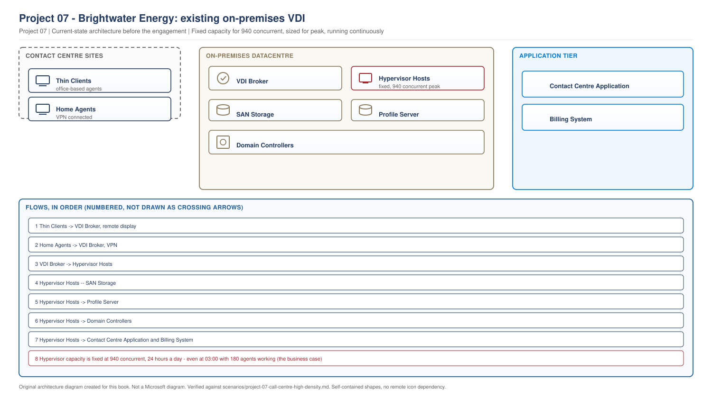
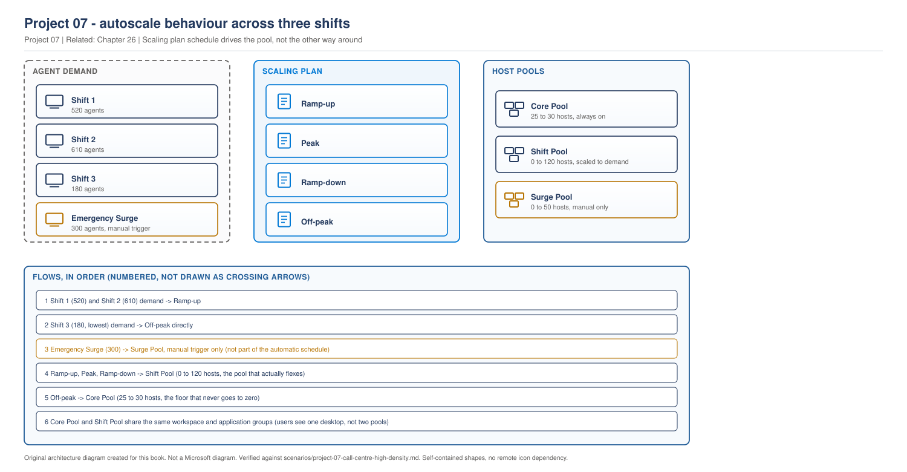
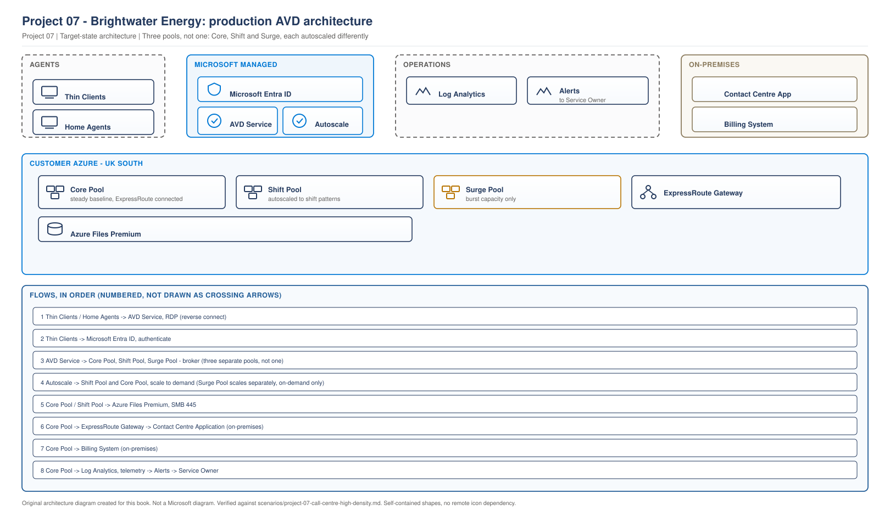

# Project 07 - Brightwater Energy: Call Centre, 1,400 Agents, Three Shifts

> **Fictional architecture case study:** Brightwater Energy is not a customer delivery record. Requirements, measurements, costs, tests, and outcomes are worked examples or validation targets unless separate lab evidence is linked.

> **Book:** Azure Virtual Desktop - Architect to Hands-on Implementation
> **Part XI:** Architecture Case Studies
> **Standard:** [PROJECT-STANDARD.md](../PROJECT-STANDARD.md)
> **Technical baseline:** August 2026
> **Concepts introduced here:** scaling plans, dynamic autoscaling, the capacity formula, density economics, capacity planning against peak rather than average

---

## Engagement brief

**What this represents.** A utility company contact centre moving from an on-premises VDI platform that has reached end of hardware life. The business case is cost, the risk is agent experience, and the thing that makes it interesting is that a call centre does not work office hours.

**The business problem.** 1,400 agents across three shifts. The existing platform is sized for peak and runs at peak twenty-four hours a day, because the hardware cannot be switched off. Finance has seen the AVD proposal and the saving, and has already put it in next year's budget. That is a pleasant problem and a dangerous one.

**Constraints that cannot be designed away.** Regulatory call recording means agents cannot be signed out mid-call. Shift handovers overlap by thirty minutes, so peak is not one moment, it is three. Average handling time is a reported KPI, and anything that adds seconds to a call is visible to the executive team within a week. The contact centre application vendor supports a fixed client version and will not certify a newer one this year.

**Previously learned concepts applied.** Host pool design and load balancing ([Chapter 15](../chapters/ch15-host-pool-design-decisions.md)), sizing method ([Chapter 17](../chapters/ch17-session-host-sizing-compute-selection.md)), profile storage burst sizing ([Chapter 20](../chapters/ch20-profile-storage-architecture.md)), monitoring and KQL ([Project 02](project-02-enterprise-850-users.md)), Teams media optimisation ([Chapter 14](../chapters/ch14-protocol-optimisation-network-performance.md)).

**New concepts introduced here.** Scaling plans and their phases, the autoscale capacity formula, why minimum percentage and capacity threshold interact, dynamic autoscaling against power management, density economics, and capacity planning for a workload with three peaks a day.

**Architectural decisions to make.** How many host pools for a single homogeneous workload. Whether to scale at all given the shift pattern. Session limit against average handling time. Whether to accept force logoff in a regulated call environment.

**What could realistically go wrong.** Scaling down during a shift handover. Disconnected agent sessions preventing scale-down and destroying the saving. Density set for cost and paying for it in handling time.

**Validation and handover.** Every scaling phase proven across a full week including a weekend, and an operations team who understand why a host is running when they think it should not be.

---

## 1. The business and the workload

**Brightwater Energy.** A UK energy supplier. 1,400 contact centre agents handling billing, faults and emergency calls, across two sites and a growing home-working population.

| Item | Value | Type |
|---|---|---|
| Named agents | 1,400 | Measurement |
| Shift 1, 06:00 to 14:30 | 520 agents | Measurement |
| Shift 2, 14:00 to 22:30 | 610 agents | Measurement |
| Shift 3, 22:00 to 06:30 | 180 agents | Measurement |
| Overlap at each handover | 30 minutes | Measurement |
| Peak concurrency, 14:00 to 14:30 handover | 940 | Measurement |
| Weekend staffing | Roughly 40 percent of weekday | Measurement |
| Emergency escalation staffing | Up to 300 additional agents at short notice | Constraint |

**Read the peak row carefully.** Peak is not shift 2 at full strength. It is the thirty minutes where shift 1 and shift 2 are both signed in. That is 940 concurrent against 1,400 named, and it happens twice a day.

**The emergency escalation row is the one that changes the architecture.** During a major supply incident the business can call in 300 additional agents with under two hours notice. A design sized for 940 concurrent fails on the day it matters most, and that day is exactly when the regulator is watching.

---

## 2. Requirements

| ID | Requirement | Source | Test |
|---|---|---|---|
| BR1 | Reduce desktop platform run cost by at least 35 percent | Finance, already in the budget | Monthly invoice against baseline |
| BR2 | No measurable increase in average handling time | Operations director | AHT reported weekly, compared to pre-migration baseline |
| BR3 | Support a 300 agent surge within two hours | Regulatory obligation | Tested surge before go-live |
| TR1 | Agent sign-in under 30 seconds at shift start | Derived from AHT concern | p95 measured across the handover window |
| TR2 | No agent signed out by the platform while on a call | Regulatory, call recording | Force logoff behaviour proven safe |
| TR3 | Capacity available before each shift starts, not during | Operations | Host availability measured at shift start minus 10 minutes |
| TR4 | Contact centre application on the vendor certified version | Vendor support | Version confirmed on every host |

**BR1 and BR2 pull against each other and everyone knows it.** Denser hosts save money and slow agents down. That tension is the whole engagement, and section 6 resolves it with a measurement rather than an opinion.

---

## 3. Existing environment

> **EXAMPLE CUSTOMER ARCHITECTURE.** Brightwater Energy as found. Our depiction of the customer's environment, not a Microsoft reference architecture.

> **OUR ORIGINAL ARCHITECTURE DIAGRAM.** Created for this book. Not a Microsoft diagram.
> Editable source: [`project07-existing-vdi.drawio`](../diagrams/architecture/project07-existing-vdi.drawio)



**What this shows.** A conventional on-premises VDI estate. Fixed hypervisor capacity sized for peak, running continuously.

**The three problems visible in this diagram.**

**Fixed capacity.** The hypervisor hosts are sized for 940 concurrent and cannot be reduced at 03:00 when 180 agents are working. That is the entire business case for moving.

**Home agents on VPN.** Every home agent adds VPN concentrator load and a support burden. AVD removes that path entirely.

**Profile server as a single point of failure.** One server holding 1,400 profiles, with a restore time nobody has measured.

**What is not visible and matters.** There is no monitoring worth the name. The platform has been sized by memory and refreshed by procurement cycle rather than by measurement, which is why nobody could state peak concurrency until we measured it.

---

## 4. Concept introduced: scaling plans and how autoscale actually decides

Everything in this engagement depends on understanding one formula and two settings. Get these wrong and either agents queue at shift start or the saving never appears.

### The phases

A scaling plan has four phases per day, each with a start time and a load balancing algorithm.

| Phase | Purpose | Configurable |
|---|---|---|
| Ramp-up | Bring capacity online before demand | Start time, algorithm, minimum percentage of active hosts, capacity threshold |
| Peak | Steady state | Start time, algorithm |
| Ramp-down | Consolidate and remove capacity | Start time, algorithm, minimum percentage, capacity threshold, force logoff and wait time |
| Off-peak | Overnight floor | Start time, algorithm |

**Peak and off-peak do not have their own capacity threshold.** Microsoft's guidance is explicit that for peak hours you can't configure the capacity threshold here. Instead, the value you entered in Ramp-down carries over. The same applies to off-peak. That surprises people who expect four independent sets of settings.

**Unselected days carry over.** If you have any days unselected in your schedule, the last off-peak parameters on the selected days are carried over for the unselected days until the next ramp-up phase. For a business running Monday to Friday schedules, that means Friday's off-peak settings govern the entire weekend, which is a real trap for a call centre that works Saturdays.

### The formula

This is the part worth learning properly. Microsoft states it directly:

**Required hosts = total sessions (active + disconnected) ÷ (max session limit × capacity threshold)**

Two consequences follow.

**Disconnected sessions count.** When you configure "Stop VMs when VMs have no active sessions" during ramp-down, autoscale treats disconnected user sessions as active sessions because it assumes users may reconnect immediately. And: to reach zero session hosts after hours, you must have zero user sessions (including disconnected).

For a call centre where agents close a laptop lid at the end of a shift rather than signing out, this single behaviour can destroy the entire saving. Section 9 is about exactly that.

**The minimum percentage setting can override the formula.** Autoscale determines the actual minimum host count during ramp-down and off-peak by using the higher of two values. If your minimum percentage setting yields a higher number than the formula result, that setting takes precedence. This minimum percentage setting is a common reason hosts remain running even when the formula suggests a lower count.

That is the answer to the most common autoscale support question: why are hosts still running when nobody is on them.

### Worked example, using Brightwater numbers

Off-peak, 02:00. 180 agents signed in. Max session limit 7. Capacity threshold 80 percent.

Required hosts = 180 ÷ (7 × 0.8) = 180 ÷ 5.6 = **33 hosts**

Now assume 90 agents from the previous shift are disconnected rather than signed out.

Required hosts = 270 ÷ 5.6 = **49 hosts**

**Sixteen extra hosts running overnight because agents did not sign out.** At roughly £160 per host per month that is £2,560 a month of pure waste, and nothing in the platform reports it as a problem.

### The permission everyone forgets

Autoscale is a service principal acting on your subscription, and it needs rights. The Desktop Virtualization Power On Off Contributor role is assigned to the Azure Virtual Desktop autoscale service principal at the host pool, resource group, or subscription scope. Without this role, autoscale can't start, stop, or deallocate session hosts.

A scaling plan with no role assignment looks perfectly configured and does nothing. It is the first thing to check when a plan appears to be ignored.

### Power management or dynamic autoscaling

Two methods. Microsoft describes the difference as Power Management deallocates session hosts while Dynamic Autoscaling can delete session hosts, and notes that the consolidation calculations and force sign-out behavior are identical for both methods.

`CURRENCY FLAG - verified August 2026, with a documentation discrepancy.` The release notes recorded dynamic autoscaling reaching general availability in June 2026, while some troubleshooting pages still carry a preview label. `[VERIFY BEFORE IMPLEMENTATION]` confirm the current support status before committing a production design to it.

---

## 5. Architecture decisions

### AD1: How many host pools

**Decision.** Three pooled host pools, aligned to shifts rather than to job function.

| Pool | Purpose | Sizing |
|---|---|---|
| `hp-bwe-core-prd-uks-01` | Always-on capacity for the overnight floor and the base of every shift | 30 hosts, never scaled below 25 |
| `hp-bwe-shift-prd-uks-01` | The scaled tier that grows and shrinks with each shift | 0 to 120 hosts |
| `hp-bwe-surge-prd-uks-01` | Emergency escalation capacity, normally at zero | 0 to 50 hosts |

**Reason.** This is the decision that goes against the obvious answer. Every agent does the same job with the same application set, so textbook guidance says one host pool. We split it because the three tiers have genuinely different scaling behaviour and different risk profiles.

The core pool never scales aggressively, so overnight agents are never affected by a scaling decision. The shift pool absorbs all the movement. The surge pool exists so that BR3 can be met by raising a maximum rather than by hoping a single pool scales fast enough during an emergency.

**Cost of the decision.** Three capacity floors instead of one, and three sets of monitoring. Roughly £3,000 a month more than a single pool would cost at the same total capacity.

**Why it was worth it.** During a supply incident, the operations director needs to know that agent capacity is not a variable. Paying £3,000 a month to remove that from the list of things that can go wrong on the worst day of the year was an easy conversation.

**What would change it.** If the surge requirement disappeared, the surge pool goes and the other two merge.

### AD2: Session limit, and the cost of getting it wrong in either direction

**Requirement.** BR1 wants density. BR2 forbids anything that slows agents down.

**Method.** Pilot with 60 real agents across three shifts, measuring both host resource use and average handling time.

| Session limit | Host CPU p95 | Memory | AHT change against baseline | Hosts needed at peak |
|---|---|---|---|---|
| 6 | 58 percent | Comfortable | No change | 157 |
| 7 | 69 percent | Comfortable | No change | 135 |
| 8 | 81 percent | Tight | +4 seconds | 118 |
| 9 | 92 percent | Pressured | +11 seconds | 105 |

**Decision. Seven.**

**Reason.** Eight saves 17 hosts, roughly £2,700 a month, and costs four seconds of average handling time. Across 1,400 agents handling roughly 45 calls a shift, four seconds is around 46 hours of agent time a day. At any realistic agent cost that is far more than £2,700 a month.

**This is the number that made the engagement.** The finance director wanted nine. The measurement turned an argument into arithmetic, and the operations director had the data to defend the agent experience.

**Type of each number.** The CPU and memory figures are measurements. The AHT deltas are measurements from the pilot. Seven is a decision. The 45 calls a shift is a measurement from the contact centre platform, not from us.

### AD3: Force logoff during ramp-down

**The conflict.** TR2 says no agent is signed out while on a call. Autoscale's force logoff is what makes scale-down actually work, because otherwise a single disconnected session keeps a host alive.

**How force logoff behaves.** Autoscale puts the session host in drain mode, sends those user sessions a notification telling them they'll be signed out, and then signs out those users after the specified wait time is over. And importantly: whether you enable autoscale to force users to sign out during ramp-down or not, the capacity threshold and the minimum percentage of hosts are still respected, autoscale only shuts down session hosts if all existing user sessions (active and disconnected) in the host pool can be consolidated to fewer session hosts without exceeding the capacity threshold.

**Decision.** Force logoff enabled on the shift pool with a 30 minute wait, and disabled on the core pool.

**Reason.** The shift pool ramps down 45 minutes after a shift ends, by which point any agent still signed in is not on a call. A 30 minute warning is generous and it satisfies the regulatory concern because it is a warning, not an immediate action. The core pool never force logs off, so an overnight agent on an emergency call is never at risk from a scaling decision.

**The complementary control.** A time limit policy signing out disconnected sessions after 60 minutes. Microsoft points at this directly: you can also configure a time limit policy that applies to all phases to sign out all disconnected users to reduce the used host pool capacity. Without it the formula in section 4 keeps counting agents who went home three hours ago.

---

## 6. Scaling architecture

> **RECOMMENDED ARCHITECTURE.** Our design for this customer, technically consistent with Microsoft's documented autoscale behaviour.

> **OUR ORIGINAL ARCHITECTURE DIAGRAM.** Created for this book. Not a Microsoft diagram.
> Editable source: [`project07-scaling-architecture.drawio`](../diagrams/architecture/project07-scaling-architecture.drawio)



**What this shows.** Demand on the left, the scaling plan phases in the middle, and the three host pools on the right. The heavy path is the normal daily cycle. The dashed amber path is the emergency surge, which is deliberately manual.

**Why surge is manual.** Autoscale reacts to sessions that already exist. During a supply incident, 300 agents are told to log in at once, and reactive scaling would have them queueing while hosts boot. The surge pool is raised by an operations decision before the agents arrive, which is the only way to meet BR3. That is a case where the automated mechanism is the wrong tool and saying so is part of the design.

**Two scaling plans, not one.** The core pool and the shift pool have different schedules, because they exist for different reasons. Sharing a plan would force the same ramp-down behaviour on both.

### The schedules

**Shift pool**, Monday to Sunday, all days selected so the weekend carry-over trap in section 4 cannot apply.

| Phase | Start | Algorithm | Min active hosts | Capacity threshold | Force logoff |
|---|---|---|---|---|---|
| Ramp-up | 05:00 | Breadth-first | 40 percent | 75 percent | Not applicable |
| Peak | 06:00 | Breadth-first | Carried | Carried | Not applicable |
| Ramp-down | 23:15 | Depth-first | 10 percent | 80 percent | Yes, 30 minute wait |
| Off-peak | 01:00 | Depth-first | Carried | Carried | Carried |

**Breadth-first through peak, not depth-first.** This is deliberate and it costs money. Standard guidance moves to depth-first at peak to consolidate ([Chapter 15](../chapters/ch15-host-pool-design-decisions.md#3-breadth-first-and-depth-first)). In a call centre, depth-first at peak means a newly arriving agent lands on the fullest host, and BR2 makes that unacceptable during the handover windows. We accept a slightly higher host count during peak in exchange for a flatter experience.

**Ramp-up at 05:00 for a 06:00 shift.** TR3 requires capacity before the shift, not during it. An hour is generous and it is measured, not assumed. During validation we confirmed capacity was available at 05:50.

**Core pool**, effectively always on, with a narrow overnight ramp-down that never goes below 25 hosts and never force logs off.

### The capacity check, per shift

| Time | Concurrent | Required hosts at limit 7, threshold 80 percent | Pool serving them |
|---|---|---|---|
| 02:00 | 180 | 33 | Core 30, shift 3 |
| 06:00 | 520 | 93 | Core 30, shift 63 |
| 14:15 handover | 940 | 168 | Core 30, shift 120, surge 18 |
| 18:00 | 610 | 109 | Core 30, shift 79 |
| 23:30 | 180 | 33 | Core 30, shift 3 |

**The handover row exceeds the shift pool maximum.** That is not an oversight. The shift pool caps at 120, so the handover peak spills into the surge pool for roughly thirty minutes twice a day. The alternative was raising the shift pool maximum to 140, which would have meant a higher floor calculation during ramp-down. Using the surge pool for the predictable twice-daily spill and for emergencies was the cheaper answer.

**This is the kind of decision that only appears once you do the arithmetic per time of day**, rather than sizing for a single peak number.

---

## 7. Density economics

The trade in BR1 against BR2, expressed as money.

| Session limit | Hosts at peak | Monthly compute | AHT cost per month |
|---|---|---|---|
| 6 | 157 | £25,100 | £0 |
| **7** | **135** | **£21,600** | **£0** |
| 8 | 118 | £18,900 | Roughly £58,000 in agent time |
| 9 | 105 | £16,800 | Roughly £160,000 in agent time |

`[VERIFY BEFORE IMPLEMENTATION]` Compute figures are indicative shapes for UK South at design time. The agent time figures use the customer's own loaded agent cost and their measured call volume, so they are their numbers, not ours.

**The lesson to take from that table.** Density optimisation has a hard stop, and it is not a technical one. Beyond a certain point you are converting a small compute saving into a large operational cost, and the operational cost lands in a different budget so nobody notices unless someone does this arithmetic.

**The mistake this table prevents.** A cost review nine months from now will look at 135 hosts and ask why the session limit is not higher. The table goes in the design document specifically so that question has an answer that does not require redoing the work.

---

## 8. Final architecture

> **RECOMMENDED ARCHITECTURE.** Brightwater Energy production design.

> **OUR ORIGINAL ARCHITECTURE DIAGRAM.** Created for this book. Not a Microsoft diagram.
> Editable source: [`project07-production-architecture.drawio`](../diagrams/architecture/project07-production-architecture.drawio)



**What this shows.** The production platform. Three host pools, the autoscale service acting on two of them, profile storage, ExpressRoute to the on-premises application tier, and the monitoring path ending at a named owner.

**The traffic that matters.** Agents connect to the AVD service and are brokered to a host. Session hosts reach profile storage over SMB and the contact centre application over ExpressRoute. Autoscale acts on the shift pool aggressively and the core pool gently.

**Why ExpressRoute.** The contact centre application and billing system stay on-premises for at least two more years. Every call touches both. Latency here is directly visible in average handling time, so this is one place where a VPN would have been a false economy.

**Where it fails.** Loss of ExpressRoute takes the platform down for its actual purpose even though AVD is healthy, because agents cannot handle calls without the application. That is the top risk in the register and it is why the circuit is dual and the failover is tested.

**Operational ownership is on the diagram deliberately.** A platform with alerts and no owner is [Project 02](project-02-enterprise-850-users.md) repeating itself.

---

## 9. What went wrong, and how it was found

Two incidents from the first eight weeks. Both are the kind that actually happen.

### The saving that did not appear

**Problem.** Four weeks after go-live, the compute bill is 12 percent below the on-premises baseline. The business case said 38 percent.

**Symptoms.** Scaling plan configured and reporting no errors. Hosts do scale down, just far less than modelled. Overnight host count sits around 70 when the model says 33.

**Business impact.** A committed saving is not being delivered, and finance has already booked it. This is a credibility problem before it is a technical one.

**Initial assumption.** Disconnected sessions counting toward the capacity formula. Call centre agents finish a shift and walk away from a thin client rather than signing out.

**Investigation.**

Count disconnected sessions at 02:00, when the platform should be near its floor:

```powershell
Get-AzWvdUserSession -ResourceGroupName rg-bwe-avd-prd-uks-01 `
  -HostPoolName hp-bwe-shift-prd-uks-01 |
  Group-Object SessionState | Select-Object Name, Count
```

Then work the formula by hand with the real numbers, and compare against the actual host count. Then check whether a time limit policy exists.

**Evidence.** At 02:00 there are 180 active sessions and 214 disconnected. The formula gives (180 + 214) ÷ (7 × 0.8) = 71 hosts, which matches exactly what is running. Autoscale was working perfectly. The input was wrong.

**Root cause.** No time limit policy for disconnected sessions. Agents from two previous shifts were still counted as occupying capacity.

**Resolution.** Time limit policy signing out disconnected sessions after 60 minutes, applied to all phases. Overnight count fell to 34 within two days.

The 60 minutes was chosen carefully rather than set to the minimum. Agents take breaks, and signing someone out after 15 minutes would generate a different and louder complaint.

**Validation.** Formula recalculated against actual host count for a full week including a weekend. Compute cost measured over the following month, landing at 36 percent below baseline.

**Prevention.** Alert on disconnected session count above a threshold, because it is a leading indicator of the saving eroding. Add the formula and the current inputs to the monthly report so the number is visible rather than discovered.

**Architect lesson.** Autoscale does what the formula says. When the saving does not appear, the formula is almost certainly right and one of its inputs is wrong. Work the arithmetic by hand before touching the configuration.

**Interview lesson.** Saying you would calculate the formula manually and compare against actual host count, rather than adjusting thresholds, shows you understand the mechanism rather than the settings.

### Agents queueing at the 14:00 handover

**Problem.** Three weeks in, agents arriving for shift 2 report waiting up to four minutes for a desktop. Only at the 14:00 handover, never at 06:00.

**Symptoms.** No errors. Sign-in slow rather than failing. Shift 1 agents unaffected. AHT for the first hour of shift 2 measurably worse.

**Business impact.** 610 agents affected daily, and it lands on the KPI that BR2 protects. The operations director raised it directly with the programme board.

**Initial assumption.** Two candidates. Storage burst at the handover, or insufficient host capacity because the shift pool has hit its maximum.

**Investigation.**

Session count and host availability across the handover window:

```kusto
WVDConnections
| where TimeGenerated > ago(7d)
| where State == "Connected"
| where hourofday(TimeGenerated) between (13 .. 15)
| summarize Connections = count() by bin(TimeGenerated, 5m)
| order by TimeGenerated asc
```

Then host counts per pool for the same window, and storage latency for the same window.

**Evidence.** Storage latency is flat, so it is not the burst. Shift pool sits at its 120 host maximum from 14:05. Surge pool host count is zero. Concurrent sessions peak at 940 against a served capacity of about 840.

**Root cause.** The design anticipated the handover spilling into the surge pool. Nobody had configured anything to make that happen. The surge pool existed, was empty, and was only ever raised manually during an emergency.

**Resolution.** A scaling plan on the surge pool with a narrow ramp-up covering the two handover windows, 05:45 to 06:30 and 13:45 to 14:45, and zero capacity outside them.

**Validation.** Sign-in p95 across the handover window measured for a full week. Fell from 3 minutes 40 to 24 seconds. AHT for the first hour of shift 2 returned to baseline.

**Prevention.** Alert when any pool reaches its configured maximum, which is the signal that spill has nowhere to go. Add the per-time-of-day capacity table from section 6 to the operations documentation, so the intended behaviour is written down rather than held in the architect's head.

**Architect lesson.** A design that depends on a pool absorbing overflow must have a mechanism that makes it happen. The capacity arithmetic was right and the implementation of it was missing, which is the gap between a design document and a working platform.

**Interview lesson.** This shows the difference between designing capacity and delivering it. Explaining that the arithmetic was correct but nothing implemented it is a more credible story than a design that was simply wrong.

---

## 10. Monitoring and alerting for this workload

Building on the monitoring architecture from [Project 02](project-02-enterprise-850-users.md), with the alerts a call centre specifically needs.

| Alert | Condition | Why this workload needs it |
|---|---|---|
| Pool at configured maximum | Any pool, 5 minutes | The handover failure. No spill capacity left |
| Capacity not ready at shift start | Available hosts below required at shift start minus 10 minutes | TR3, and it fires before agents arrive |
| Disconnected sessions above 120 | Sustained 30 minutes | The saving erosion, as a leading indicator |
| Sign-in p95 above 30 seconds | Sustained 10 minutes in a handover window | TR1, scoped to when it matters |
| Autoscale action failed | Any occurrence | Usually the missing Power On Off Contributor role |
| Host CPU above 85 percent | Sustained 10 minutes | Density guard, tighter than standard because of AHT |
| ExpressRoute circuit down | Any occurrence | The application dependency, not the AVD dependency |

**Two of these are unusual and both are workload specific.** Alerting on a pool reaching its maximum is not a standard AVD alert, and it is the one that would have caught the handover problem on day one. Alerting on disconnected session count is not standard either, and it protects the business case.

**Scoped alerting matters here.** The sign-in alert only evaluates during handover windows. An unscoped version would fire at 03:00 when four agents sign in slowly and nobody cares, and the team would stop reading it.

---

## 11. Validation before handover

Every requirement tested against a real week, including a weekend, because the weekend carry-over behaviour in section 4 is a real trap.

| Requirement | Test | Result |
|---|---|---|
| BR1 | Monthly compute against on-premises baseline | 36 percent reduction, after the time limit policy |
| BR2 | AHT weekly against pre-migration baseline | No measurable change at session limit 7 |
| BR3 | Surge test. 300 agents signed in within 90 minutes on a Saturday | Capacity available, sign-in p95 31 seconds |
| TR1 | Sign-in p95 across both handover windows, one week | 24 seconds |
| TR2 | Force logoff observed on the shift pool with agents present | Warning received, 30 minutes elapsed, no agent on a call affected |
| TR3 | Available hosts at shift start minus 10 minutes, one week | Met every shift |
| TR4 | Application version on every host | Confirmed from the image and spot checked |

**The surge test was run on a Saturday with real agents on overtime.** Simulating it would have proven nothing, because the failure mode is 300 people signing in within a few minutes and no synthetic test reproduces that convincingly. It cost the customer a Saturday morning of overtime and it was the most valuable test in the engagement.

**BR2 deserves a note.** No measurable change is not the same as no change. The honest position given to the operations director was that AHT is influenced by many things and the pilot showed no signal at session limit 7, whereas it showed a clear signal at 8. That is evidence of a threshold, not proof of zero impact.

---

## 12. Day-2 operations

The operating model from [Project 02](project-02-enterprise-850-users.md) applies, with three additions specific to scaling.

**The question operations will be asked most.** Why is a host running when nobody is on it. The answer is in section 4, and it is in the runbook, because otherwise someone will assume autoscale is broken and start changing thresholds.

```
Runbook: Hosts running when the pool looks empty
Trigger:        Operations or finance query about host count
Owner:          Platform operations
Prerequisites:  Reader on the host pool
Impact:         None. This is an investigation, not a change
Rollback:       Not applicable
Steps:
  1. Count active and disconnected sessions on the pool
  2. Calculate required hosts: (active + disconnected) / (max session limit x capacity threshold)
  3. Compare with the minimum percentage of active hosts for the current phase
  4. The expected host count is the higher of the two
  5. If actual matches expected, autoscale is working. Report the input, not a fault
  6. If disconnected sessions are the cause, check the time limit policy is applied
  7. If actual exceeds expected, check for hosts in drain mode or with agent errors
Validation:     Actual host count explained by the formula
Escalation:     If actual exceeds expected with no drain or agent issue, raise to engineering
```

**Seasonal capacity review, quarterly.** Energy contact centres are seasonal. Winter volumes are materially higher, and the maximum host counts need reviewing before winter rather than during it. This is in the operating calendar with the service owner's name on it.

**Surge readiness test, twice a year.** BR3 is a regulatory obligation and an untested capability is not a capability. Once a year would be defensible. Twice is better, because the platform changes.

---

## 13. Trade-offs

| Trade-off | Given up | Why | What would change it |
|---|---|---|---|
| Three host pools, not one | Roughly £3,000 a month | Surge capacity as a certainty rather than a hope | Losing the regulatory surge obligation |
| Breadth-first through peak | Some consolidation saving | BR2. New agents must not land on the fullest host | A workload where handling time is not a KPI |
| Session limit 7, not 8 | £2,700 a month | Four seconds of AHT costs far more in agent time | A cheaper agent cost or a smaller call volume |
| 60 minute disconnect timeout | Some additional saving | Agents take breaks, and a shorter timeout creates a louder complaint | Evidence that breaks are shorter than assumed |
| Manual surge trigger | Automation | Reactive scaling cannot meet a two hour surge with agents arriving at once | Predictive scaling based on incident signals, if that becomes available |
| ExpressRoute, not VPN | Roughly £1,400 a month | Every call touches the on-premises application. Latency is visible in AHT | Moving the contact centre application to Azure |

**The one that will be challenged.** Session limit 7 when 8 works technically. The defence is the arithmetic in section 7, in the design document, with the customer's own agent cost figures. That table has already survived one cost review.

---

## 14. Interview questions from this engagement

### Q. Explain how AVD autoscale decides how many hosts to run.

**Strong answer**
"It calculates required hosts as total sessions, active and disconnected, divided by the max session limit multiplied by the capacity threshold. Then it takes the higher of that result and whatever the minimum percentage of active hosts works out to for the current phase. That second part is the answer to the most common question in production, which is why hosts are still running when the pool looks empty. The other detail that matters is that disconnected sessions count as active, so to reach zero hosts you need zero sessions including disconnected. In a call centre where agents walk away from a thin client rather than signing out, that single behaviour can eliminate most of your saving, and the fix is a time limit policy rather than a scaling change."

### Q. A customer says autoscale is not saving them money. How do you investigate?

**Strong answer**
"I would work the formula by hand before touching any configuration. Count active and disconnected sessions at the time the pool should be at its floor, calculate the required hosts, and compare with what is actually running. In the engagement I am describing they had 180 active and 214 disconnected sessions at two in the morning, the formula gave 71 hosts, and 71 hosts were running. Autoscale was working perfectly and the input was wrong. Adjusting thresholds would have made it worse, because the real fix was a time limit policy for disconnected sessions. If the formula does not explain the host count, then I would check the Power On Off Contributor role assignment, because without it a scaling plan looks configured and does nothing at all."

### Q. How do you decide the session limit for a call centre?

**Strong answer**
"By measuring both sides. Host resource use tells you what the platform can carry. Average handling time tells you what the business can carry, and in a contact centre that is the number that matters. We piloted at six, seven, eight and nine with real agents across three shifts. Eight saved seventeen hosts, about £2,700 a month, and cost four seconds of handling time. Across 1,400 agents at 45 calls a shift that is roughly 46 hours of agent time a day, which is far more expensive than the compute saving. So seven, and the table goes in the design document so the next cost review has an answer without redoing the work. The general point is that density optimisation has a hard stop that is commercial, not technical, and the cost usually lands in a different budget from the saving."

### Q. How would you handle a workload with three shifts rather than office hours?

**Strong answer**
"The first thing is that peak is not the biggest shift, it is the handover, when two shifts are signed in at once. That was 940 concurrent against 1,400 named users, twice a day. So I sized against the handover, not against the largest shift. Then I split the host pools by scaling behaviour rather than by job function, which is unusual: a core pool that never scales aggressively so overnight agents are never affected, a shift pool that absorbs all the movement, and a surge pool for the regulatory obligation to add 300 agents at short notice. And I would watch the weekend, because if you only select weekdays in a scaling schedule, Friday's off-peak settings carry over across the whole weekend, and a call centre works Saturdays."

### Q. What would you do differently?

**Honest answer**
"Two things. I designed the handover peak to spill into the surge pool and never implemented a mechanism to make that happen, so for three weeks agents queued at 14:00 while a design document said they would not. The arithmetic was right and nothing delivered it, which is a gap I should have caught in validation rather than in production. And I would have set the time limit policy for disconnected sessions on day one rather than waiting for the saving to fall short. It was predictable from the formula, and I knew the agent behaviour before we went live."
