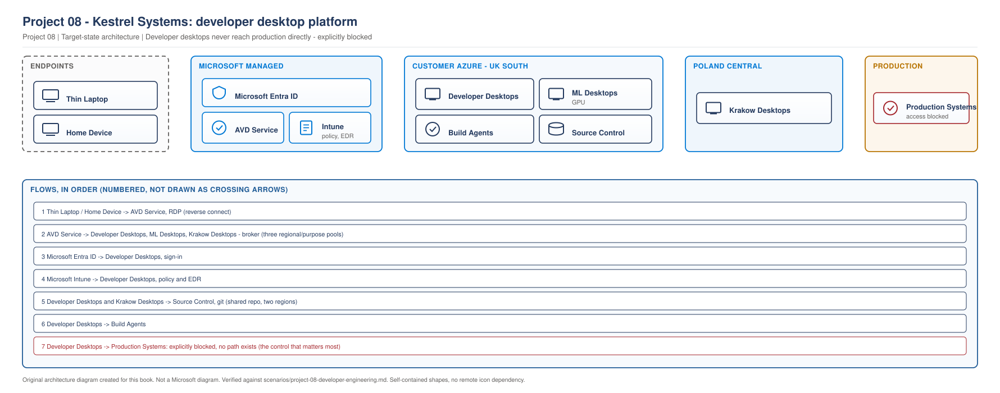

# Project 08 - Kestrel Systems: Developer Desktops, Local Admin and the Cost of Personal Pools

> **Fictional architecture case study:** Kestrel Systems is not a customer delivery record. Requirements, measurements, costs, tests, and outcomes are worked examples or validation targets unless separate lab evidence is linked.

> **Book:** Azure Virtual Desktop - Architect to Hands-on Implementation
> **Part XI:** Architecture Case Studies
> **Standard:** [PROJECT-STANDARD.md](../PROJECT-STANDARD.md)
> **Technical baseline:** August 2026
> **Concepts introduced here:** personal host pool assignment types, Start VM on Connect, power state as the cost lever for personal pools, local administrator on a persistent desktop, configuration drift on machines you cannot rebuild freely, nested virtualisation considerations

---

## Engagement brief

**What this represents.** A software business moving developers off physical workstations. Developers are the hardest AVD population because everything that makes pooled AVD cheap does not apply to them, and everything security wants is the opposite of what they need.

**The business problem.** Kestrel has 340 developers across three sites and an offshore team in Kraków. Source code has to stop living on laptops after a near miss where a stolen machine held a full repository clone. The security team has a mandate. The engineering directors have a productivity KPI and a long memory of a failed VDI attempt in 2019.

**Constraints that cannot be designed away.** Developers need local administrator. That is not negotiable and pretending otherwise wastes a month. Build times are measured and reported, so anything that makes a build slower is visible. Several teams run containers, which needs nested virtualisation. And the Kraków team works hours that overlap the UK afternoon only, so a single scaling schedule does not fit.

**Previously learned concepts applied.** Host pool types and why personal costs more ([Chapter 15](../chapters/ch15-host-pool-design-decisions.md)), sizing method ([Chapter 17](../chapters/ch17-session-host-sizing-compute-selection.md)), image strategy ([Chapter 23](../chapters/ch23-golden-image-engineering.md)), Intune on single-session hosts ([Chapter 24](../chapters/ch24-intune-and-avd-endpoint-management.md)), monitoring ([Project 02](project-02-enterprise-850-users.md)), autoscale mechanics ([Project 07](project-07-call-centre-high-density.md)).

**New concepts introduced here.** Personal desktop assignment types and what each costs operationally. Start VM on Connect, its behaviour on personal pools and the role assignment it depends on. Power state as the only real cost lever on a personal pool. Local administrator on a desktop that persists. Configuration drift when rebuild-first is not available. Nested virtualisation as a sizing constraint.

**Architectural decisions to make.** Personal or pooled. How local admin is granted and contained. How to control cost when autoscaling does not apply the way it does for pooled. What happens to a developer's machine when the image changes.

**What could realistically go wrong.** A cost model built on deallocation that developers defeat by leaving work running. Machines that diverge until nobody can reproduce a build failure. A power management change that kills an overnight build.

**Validation and handover.** Build times measured before and after, and an operations team who can rebuild a developer desktop without losing the developer's work.

---

## 1. The population and what makes it different

**Kestrel Systems.** A payments software business, 620 staff, of whom 340 are engineers.

| Team | Count | Working pattern | Workload |
|---|---|---|---|
| Backend engineers | 140 | UK hours, heavy builds | IDE, containers, local databases |
| Frontend engineers | 90 | UK hours | IDE, browsers, build tooling |
| QA and automation | 60 | UK hours, long overnight test runs | Test harnesses, containers |
| Kraków team | 50 | 10:00 to 18:00 CET | Same as backend |

**Peak concurrency 290**, measured across four weeks. Total named users 340.

### Why the pooled model does not apply

Everything that makes pooled AVD cheap fails here.

**Density.** A backend engineer running a build can consume an entire host. Multi-session would mean one developer's compile degrading seven colleagues, and the KPI is build time.

**Statelessness.** Developers keep local repositories, containers, test data and tooling configuration. A disposable host means recreating that daily.

**Local administrator.** Required for installing SDK versions, driver-level debugging tools and container runtimes. On a shared host, local admin means one developer can affect seven others, which is unacceptable.

**The uncomfortable conclusion.** Personal host pools, which cost roughly three times per user what pooled costs, before any optimisation. Section 5 is about getting that back.

---

## 2. Requirements

| ID | Requirement | Source | Test |
|---|---|---|---|
| BR1 | Source code does not persist on any endpoint device | Security, post-incident | Attempt to copy a repository to a local drive, blocked |
| BR2 | No increase in median build time | Engineering directors | Build time measured before and after, same projects |
| BR3 | Platform cost within 15 percent of the physical workstation refresh it replaces | Finance | Monthly cost against the refresh amortisation |
| BR4 | Developers retain local administrator | Engineering, non-negotiable | Developer can install an SDK without raising a ticket |
| TR1 | Container workloads run on the desktop | Backend and QA teams | Container build and run tested on a session host |
| TR2 | A developer desktop can be rebuilt without losing their work | Operations | Timed rebuild with work preserved |
| TR3 | Desktop available within 90 seconds of connecting | Derived from the 2019 failure | Measured cold start |
| TR4 | Kraków team unaffected by UK schedules | Kraków lead | Availability measured against CET hours |

**BR3 and BR4 pull against each other through a third party.** Local admin means developers install things, which means machines drift, which means you cannot rebuild them freely, which means you cannot use the image-based operating model that keeps costs and effort down. That chain is the engagement.

**TR3 exists because of the 2019 failure.** The previous VDI attempt had a two to three minute wait on first connection each morning, and it is the specific thing engineers remember. Any design with a slow cold start would have been rejected on sight regardless of its merits.

---

## 3. Concept introduced: personal host pools in practice

Pooled host pools have been covered ([Chapter 15](../chapters/ch15-host-pool-design-decisions.md)). Personal pools behave differently in three ways that matter here.

### Assignment type

Microsoft describes the two options: users can automatically be assigned to any previously unassigned personal desktop in the host pool when they connect. Alternatively, you can assign users to a specific personal desktop before they connect.

```bash
# Direct assignment: an administrator assigns each user to a specific host
az desktopvirtualization hostpool update \
  --resource-group rg-ksl-avd-prd-uks-01 \
  --name hp-ksl-dev-prd-uks-01 \
  --personal-desktop-assignment-type Direct
```

**What this does.** Sets the host pool so that users must be assigned to a specific session host rather than being given the next free one.
**Prerequisites.** Desktop Virtualization Host Pool Contributor, and the `desktopvirtualization` CLI extension.
**Expected result.** The host pool property reflects the assignment type. Existing assignments are unaffected.
**Common failure.** Changing assignment type on a pool with existing assignments and expecting them to be re-evaluated. They are not.

**Which to choose.** Automatic for most estates, because it removes an administrative step per joiner. Kestrel chose Direct, and section 4 explains why that unusual choice was correct here.

### Persistence

Microsoft states the benefit plainly: personal desktops are ideal for users with resource-intensive workloads because the user experience and session performance improves if there's only one session on the session host. Another benefit of this host pool type is that user activities, files, and settings can persist on the virtual machine operating system (VM OS) disk after the user signs out because it's only for them.

**That persistence is the feature and the problem.** It is why developers can keep their environment, and it is why you cannot treat a developer host as disposable.

### Start VM on Connect

The cost lever. On a personal pool, hosts are allocated to individuals and cannot be consolidated the way pooled hosts can, so the only saving available is having them powered off when nobody is using them.

Microsoft describes the behaviour, and the personal and pooled cases differ: for personal host pools, Start VM on Connect only powers on an existing session host VM that is already assigned or can be assigned to a user. For pooled host pools, Start VM on Connect only powers on a session host VM when none are turned on and more VMs are only be turned on when the first VM reaches the session limit.

And the cost that comes with it: the time it takes for a user to connect to a remote session on a session host that is powered off (deallocated) increases because the VM needs time to power on again, much like turning on a physical computer. When a user uses Windows App and the Remote Desktop app to connect to Azure Virtual Desktop, they're told a VM is being powered on while they're connecting.

**That paragraph is TR3 in a nutshell.** The cost saving depends on hosts being off, and hosts being off means users wait. Section 5 measures that wait rather than guessing at it.

**The permission it depends on.** Configuring the feature needs Desktop Virtualization Host Pool Contributor. Making it work needs a role assignment for the AVD service principal, which is a separate thing entirely and is the subject of the first incident in section 8.

---

## 4. Architecture decisions

### AD1: Personal or pooled

**Requirement.** 340 developers, local admin, container workloads, build time as a KPI.

**Option A. Pooled with a high specification host and a low session limit**, for example three developers on a 16 vCPU host.

Rejected, for three separate reasons any one of which would be sufficient. Local admin on a shared host means one developer can break the environment for two others. A single build can consume the host, so build time becomes dependent on what colleagues are doing. And developer state would live in a profile container, which is not designed for the volume of small files a repository and a container cache produce.

**Option B. Personal host pools.** Selected.

**Option C. Physical workstations with disk encryption and DLP.** The status quo, and it was seriously considered, because it is cheaper.

Rejected on BR1. Encryption protects a powered-off device. The near miss involved a machine that was awake and unlocked, and the security team's position was that the data should not be on the device at all.

**Decision. Personal host pools, three of them.**

| Pool | Teams | Host size | Reason |
|---|---|---|---|
| `hp-ksl-dev-prd-uks-01` | Backend, frontend, QA | D16as v5 | Build performance. Sizing in section 5 |
| `hp-ksl-devkrk-prd-pln-01` | Kraków team | D16as v5 | Different region and different schedule |
| `hp-ksl-devgpu-prd-uks-01` | 12 engineers doing ML work | GPU SKU | Separate image and drivers |

**Why a separate Kraków pool rather than a separate schedule.** Two reasons. Latency to Poland from UK South was measured at a level that was acceptable but not good, and the scaling schedule differences would have required workarounds in a single pool. A pool in Poland Central solved both, and the cost of a second pool is small when hosts are personal anyway.

### AD2: Assignment type

**Decision. Direct assignment.**

**Reason.** This is the decision that goes against the usual answer, and it comes from BR4. When a developer has local administrator and their machine persists, that machine becomes theirs in a meaningful way. A support call is about a specific machine with a specific history. Automatic assignment would still produce a stable mapping in practice, and Direct makes the mapping explicit, visible in the portal, and manageable when someone leaves.

**The cost.** An administrative step per joiner and mover. Kestrel automated it, so the joiner process assigns the desktop as part of onboarding.

**When automatic would be correct.** A population without local admin, where any desktop is equivalent to any other and support never needs to care which host a person has.

### AD3: Local administrator

**Requirement.** BR4 says developers keep local admin. Security wants it removed.

**Decision. Developers hold local administrator on their own assigned desktop, and nothing else.**

**Reason and containment.** The risk of local admin is lateral movement and shared impact. On a personal desktop with one user, the blast radius is the user's own machine. Containment comes from four controls rather than from removing the privilege.

| Control | What it does |
|---|---|
| One user per host | Local admin cannot affect a colleague |
| No local admin on any shared or production system | The privilege does not extend beyond the desktop |
| EDR with tamper protection | Local admin cannot disable endpoint protection |
| Session host network segmentation | The desktop subnet cannot reach production systems |

**Rejected alternative.** Just-in-time elevation through a privilege management product. It was costed and it would have worked. It was rejected because it adds a per-user licence for 340 people to solve a risk that segmentation already contains, and because engineering had a strong and reasonable objection to being interrupted mid-task.

**What security got in exchange.** BR1 is met by the platform rather than by restricting the developer, source code never leaves the datacentre, and the four controls above are enforceable and auditable. That was a better outcome for them than local admin removal that engineering would have fought for a year.

### AD4: Nested virtualisation

**Requirement.** TR1. Container workloads on the desktop.

**Decision.** VM sizes selected for nested virtualisation support, confirmed by testing rather than by documentation alone.

**Reason.** Container tooling on Windows typically requires nested virtualisation, and not every Azure VM size supports it. This is a sizing constraint that comes before performance sizing, because a host that cannot run containers is unusable for two of the four teams regardless of how fast it is.

`[VERIFY BEFORE IMPLEMENTATION]` Confirm nested virtualisation support for the specific VM size and region in the current Azure documentation before committing. Support varies by size family and generation.

**Validation.** A container build and run performed on a candidate host by a member of the backend team, during the sizing pilot, before the size was fixed.

---

## 5. Sizing and the cost problem

Personal pools remove density as a lever, so the sizing question changes from "how many users per host" to "what does each user need and how long is it powered on".

### Sizing

| Step | Value | Type |
|---|---|---|
| Baseline: current physical workstation | 8 core, 32 GB, NVMe | Measurement |
| Candidate size | D16as v5, 16 vCPU, 64 GB | Decision |
| Median build time, physical | 4 minutes 10 seconds | Measurement |
| Median build time, D8as v5 pilot | 6 minutes 40 seconds | Measurement |
| Median build time, D16as v5 pilot | 3 minutes 55 seconds | Measurement |
| Disk | Premium SSD, 512 GB | Decision |

**The D8as result is why the pilot existed.** It looked adequate on paper and it failed BR2 by 60 percent. Sizing developer desktops from a specification sheet does not work, because build performance depends on the specific project, its dependency graph and its disk behaviour.

**Disk mattered more than expected.** Moving from Standard SSD to Premium SSD in the pilot cut a further 40 seconds off the median build. Developer workloads are disk-heavy in a way that knowledge worker workloads are not, and the first pilot round had underestimated it.

### The cost lever

340 personal hosts at D16as v5 running continuously is a number nobody would approve. Power state is the only lever.

| Scenario | Effective hours per host per month | Relative cost |
|---|---|---|
| Always on | 730 | 100 percent |
| Business hours only, 07:00 to 19:00 weekdays | 260 | 36 percent |
| Start VM on Connect plus overnight deallocation | Roughly 190 measured | 26 percent |

**Measured, not assumed.** The 190 hours came from four weeks of pilot data across 40 developers. The assumption before measurement was 220, and the difference is because developers do not work the hours anyone thinks they do.

### Cold start, because it decides whether this is acceptable

TR3 requires 90 seconds. Start VM on Connect means the host is deallocated when the developer connects in the morning.

| Measurement | Result |
|---|---|
| Deallocated to Windows sign-in prompt, D16as v5 | 62 to 78 seconds |
| Sign-in to usable desktop | 8 to 12 seconds |
| Total cold start | 70 to 90 seconds |

**At the edge of the requirement, and it passed.** It was also the single most contentious measurement in the engagement, because 90 seconds is a long time when it happens every morning and the 2019 failure is still in people's memory.

**What made it acceptable.** Developers were shown the measurement, told exactly what was happening and why, and given the alternative cost. Engineering accepted it. A design that had hidden the cold start and hoped nobody noticed would have failed politically within a fortnight.

---

## 6. Architecture

> **RECOMMENDED ARCHITECTURE.** Kestrel Systems developer platform.

> **OUR ORIGINAL ARCHITECTURE DIAGRAM.** Created for this book. Not a Microsoft diagram.
> Editable source: [`project08-developer-platform.drawio`](../diagrams/architecture/project08-developer-platform.drawio)



**What this shows.** Personal desktops in two regions, with source control and build agents alongside them, and a deliberately blocked path to production.

**The red dashed line is the security control that makes local admin acceptable.** Developer desktops cannot reach production systems. Local administrator on a machine with no route to anything that matters is a contained risk.

**Why build agents are separate.** Long-running CI builds do not belong on a developer's desktop. Moving them to dedicated agents removed a large part of the reason developers wanted their machines always on, which directly improved the cost position.

**Where it fails.** Loss of source control affects everyone but does not stop desktops working. Loss of a developer's individual desktop affects one person, which is the upside of personal pools.

---

## 7. Image and drift

This is the hard operational problem in a personal estate, and it has no clean answer.

**The conflict.** Pooled hosts are replaced monthly and drift does not exist. Personal hosts persist by design, and developers with local admin install things. Within six months, 340 machines are 340 different machines.

**What Kestrel decided.**

| Approach | Applied to |
|---|---|
| Image updates apply to new desktops only | All pools |
| Monthly patching in place through Intune | All pools |
| Voluntary refresh, developer initiated | Any developer who wants a clean machine |
| Mandatory rebuild every 12 months | All desktops, scheduled with the individual |

**Why an annual mandatory rebuild.** Without it, machines diverge indefinitely and eventually nobody can reproduce a problem. Twelve months was negotiated. Engineering wanted never, security wanted quarterly, and twelve months with a scheduled slot and a preparation checklist was the agreement.

**What makes the rebuild tolerable.** TR2. Work is preserved because repositories live in source control, containers are rebuilt from files in the repository, and a documented per-developer settings export exists. The rebuild is 45 minutes of a developer's time, once a year, and the checklist is what makes that true rather than a two-day recovery.

**The honest position.** This is worse than the pooled operating model and it is the price of BR4. Anyone claiming personal pools with local admin can be operated as cleanly as pooled hosts has not run one.

---

## 8. L3 incident: Start VM on Connect does nothing

**Incident.** During the pilot, developers connecting to a deallocated desktop receive a connection error rather than the desktop powering on.

**Impact.** 40 pilot developers unable to start work without an administrator manually starting their VM. Two days into a pilot whose entire purpose was to prove the cost model works.

**Scope.** All personal pools. Every deallocated host. Hosts already running connect normally.

**Initial triage.** Confirm the setting is enabled rather than assuming.

```bash
az desktopvirtualization hostpool show \
  --resource-group rg-ksl-avd-prd-uks-01 \
  --name hp-ksl-dev-prd-uks-01 \
  --query "startVMOnConnect"
```

Returns true. The setting is on.

**Evidence collection.** Check whether the AVD service principal holds the role that lets it power on virtual machines.

```bash
az role assignment list \
  --scope "/subscriptions/<subscription-id>" \
  --query "[?roleDefinitionName=='Desktop Virtualization Power On Contributor']" -o table
```

Returns nothing.

Then check the activity log on one of the affected virtual machines for a start operation attempt in the window when a developer tried to connect. There is none, which means nothing tried to start the VM rather than something tried and failed.

**Hypothesis.** The feature is enabled on the host pool but the service principal has no permission to act. Enabling the setting and granting the role are two separate steps, and only one was done.

**Testing.** Assign the role at subscription scope, wait for propagation, then have a pilot developer connect to a deallocated host.

```bash
az role assignment create \
  --assignee <avd-service-principal-object-id> \
  --role "Desktop Virtualization Power On Contributor" \
  --scope "/subscriptions/<subscription-id>"
```

`[VERIFY BEFORE IMPLEMENTATION]` Confirm the current service principal identifier and the required scope in the Microsoft documentation. The application used by the AVD service has changed name historically and the scope can be subscription, resource group or host pool.

**Root cause.** The role assignment for the AVD service principal was missing. Without it, the service cannot start, stop or deallocate session hosts, so the feature is configured and inert.

**Remediation.** Role assigned at subscription scope, covering all three host pools including the Poland Central pool.

**Validation.** A developer connects to a deallocated host and it powers on. Then the same test on the Kraków pool, because a subscription-scope assignment should cover it and confirming is cheaper than assuming. Cold start timings from section 5 were captured during this validation rather than in a separate exercise.

**Prevention.** The role assignment is now in Terraform alongside the host pool, so a new pool cannot be created without it. A pilot checklist item requires a cold start test on day one rather than day three.

**Runbook update.** New KB: "Start VM on Connect does nothing." First check is the role assignment for the service principal, not the host pool setting, because the host pool setting is the one people look at and it is almost always correct.

**Lesson.** A feature with two configuration steps in two different places will be half configured. The pattern is the same as the autoscale role in [Project 07](project-07-call-centre-high-density.md#4-concept-introduced-scaling-plans-and-how-autoscale-actually-decides), and recognising the pattern is what turns a two day investigation into a five minute one.

---

## 9. L3 incident: overnight test runs killed by power management

**Incident.** Three weeks after the QA team migrated, overnight automated test runs are failing. The failures are inconsistent and the test output shows the run stopping partway rather than a test failing.

**Impact.** QA losing a night of test coverage roughly three times a week. The release train depends on overnight results being available at 08:00, so a lost night delays a release decision by a day.

**Scope.** QA desktops only. Backend and frontend developers unaffected. Failures cluster between 21:00 and 23:00.

**Initial triage.** Test output ends abruptly rather than reporting a failure, which suggests the process was terminated rather than the test failing. That points at the platform, not the tests.

**Evidence collection.** Check the power state history of an affected desktop.

```bash
az monitor activity-log list \
  --resource-group rg-ksl-hosts-prd-uks-01 \
  --offset 7d \
  --query "[?contains(operationName.value,'deallocate') || contains(operationName.value,'powerOff')].{time:eventTimestamp, op:operationName.value, caller:caller, resource:resourceId}" \
  -o table
```

The log shows deallocation events on QA desktops between 21:00 and 23:00, initiated by an automation account.

Then check what performs that action. Kestrel had an Azure Automation runbook, inherited from the physical workstation era, that deallocated idle virtual machines outside business hours.

**Hypothesis.** Two power management mechanisms are operating on the same hosts. Start VM on Connect handles connection-time power on, and a legacy automation runbook is deallocating idle hosts on a schedule. A test run leaves no interactive session, so the host looks idle.

**Testing.** Disable the runbook for two QA desktops for one week and observe. Both complete every overnight run. The remaining QA desktops continue to fail intermittently.

**Root cause.** An idle-detection runbook that measures interactive sessions rather than actual work. A machine running a four hour test suite with no user signed in is, by that definition, idle.

**Remediation.** Three parts, because the immediate fix alone would have cost money.

Immediate: exclude QA desktops from the runbook by tag.

Then the better answer: move the overnight test runs to the build agents, where they belong. They do not need a developer desktop, and putting them there let QA desktops deallocate overnight like everyone else's.

Then remove the legacy runbook entirely, once Start VM on Connect and the scheduled deallocation policy were confirmed to cover the estate. Two mechanisms doing the same job is how this happened.

**Validation.** Overnight runs complete for two consecutive weeks after moving to build agents. QA desktop power-on hours measured and confirmed back in line with other teams, which proves the cost model was not damaged by the fix.

**Rollback.** The exclusion tag was the rollback position throughout. If moving tests to build agents had failed, the tag kept QA working while another approach was found.

**Prevention.** One power management mechanism per host pool, documented. A tag-based exclusion model with a register of what is excluded and why, reviewed quarterly, so exclusions cannot quietly accumulate.

**Runbook update.** KB entry: "Work stops overnight on a personal desktop." First check is the activity log for deallocation events and their caller, before investigating the workload.

**Lesson.** Idle detection based on interactive sessions is wrong for developer and test workloads. More generally, when a platform changes, the automation built for the old platform does not automatically stop running, and inherited automation is invisible until it does something unexpected.

---

## 10. Cost outcome

`[VERIFY BEFORE IMPLEMENTATION]` Indicative shapes for UK South and Poland Central at design time.

| Line | Monthly |
|---|---|
| Developer desktops, 280 hosts, D16as v5, roughly 190 hours each | £39,800 |
| Kraków desktops, 50 hosts | £7,100 |
| ML desktops, 12 GPU hosts | £6,400 |
| Premium SSD disks, 342 at 512 GB | £11,600 |
| Build agents | £2,900 |
| Networking, monitoring, other | £1,800 |
| **Total** | **£69,600** |

**Against the physical alternative.** The workstation refresh was £1.94 million over four years, roughly £40,400 a month amortised, plus support and replacement handling. AVD is more expensive on that comparison and it was approved anyway, because BR1 is a security requirement rather than a cost optimisation and the board treated it as such.

**That is worth being clear about.** This project does not save money. It was never going to. Presenting it as a cost saving would have been dishonest and would have collapsed the first time someone read an invoice.

**Where the cost lever actually is.** Disks. 342 Premium SSD disks bill whether or not the host is running, and they are 17 percent of the total. Reducing disk size or tier is the only significant saving available that does not affect build time, and it was examined and rejected because Premium SSD was worth 40 seconds per build.

**The number that surprised finance.** Powered-off hosts still cost money through their disks. A personal pool has a floor that a pooled estate does not, and that floor is proportional to headcount rather than to concurrency.

---

## 11. Day-2 operations

**Ownership.** Platform operations own the pools, images and power management. Engineering owns what is installed on individual desktops. That line is written down, because the first support call after go-live was about a broken SDK installation and it was not a platform problem.

**The support boundary, published to developers.**

| Problem | Owner |
|---|---|
| Desktop will not start or connect | Platform |
| Slow build, all developers | Platform |
| Slow build, one developer after they changed something | Engineering, with platform assistance |
| Software installation failure | Engineering. Local admin means self-service |
| Desktop needs rebuilding | Platform, with the developer's preparation checklist |

**Joiner and leaver.** Direct assignment means both are explicit. A joiner is assigned a desktop as part of onboarding. A leaver's desktop is unassigned and rebuilt, not reassigned as-is, because it contains their configuration and possibly their credentials.

**Quarterly.** Review the power management exclusion register. Review desktops that have not been rebuilt in over twelve months.

**Annually.** The mandatory rebuild cycle, scheduled per developer with two weeks' notice.

---

## 12. Trade-offs

| Trade-off | Given up | Why | What would change it |
|---|---|---|---|
| Personal pools | Density, and roughly three times the per-user cost | Local admin, build performance and persistent state make pooled unworkable | A development model without local admin, which is not this business |
| Local admin retained | The security team's preferred posture | Non-negotiable for engineering. Contained by segmentation, EDR and one user per host | A privilege management product, costed and rejected |
| Direct assignment | An administrative step per joiner | Support needs to know whose machine is whose when machines are personal | A population without local admin |
| Start VM on Connect | 70 to 90 seconds every morning | It is the only cost lever on a personal pool, and it is worth 74 percent | Nothing. This was measured and accepted with engineering |
| Annual mandatory rebuild | Developer time, once a year | Without it, drift makes problems unreproducible | A rebuild-on-demand culture, which is a cultural change not a technical one |
| Premium SSD disks | Roughly £4,000 a month against Standard SSD | 40 seconds per build across 340 developers | A workload less sensitive to disk |
| Project does not save money | The easy business case | BR1 is a security requirement | Nothing. It was presented this way from the start |

**The one that will be challenged.** Local administrator. The defence is that the risk was contained rather than accepted: one user per host so there is no lateral impact, no route to production, EDR with tamper protection, and no local admin anywhere except a developer's own desktop. Removing it would have cost a year of organisational conflict to protect a machine that already cannot reach anything important.

---

## 13. Interview questions from this engagement

### Q. How do you design AVD for developers?

**Strong answer**
"Accept early that everything making pooled AVD cheap does not apply. Density fails because one build consumes a host and build time is usually a KPI. Statelessness fails because developers keep repositories, containers and tooling. And local admin on a shared host means one person can break it for seven others. So personal pools, and then the design problem becomes cost, because you have lost density as a lever. The only lever left is power state, so Start VM on Connect plus scheduled deallocation, which at this customer took hosts from 730 effective hours a month to about 190. That has a visible cost: a 70 to 90 second cold start every morning. I would measure that and show it to the engineering team rather than hide it, because they will notice on day one and a design that surprised them would lose their support."

**Follow-up you should expect**
"What about local admin?" Grant it and contain it. One user per host so there is no lateral impact, no network route from developer desktops to production, EDR with tamper protection, and local admin nowhere else. Trying to remove it costs a year of conflict to protect a machine that cannot reach anything that matters.

### Q. Start VM on Connect is enabled and nothing happens. Why?

**Strong answer**
"Almost certainly the role assignment. Enabling the setting on the host pool and granting the AVD service principal permission to power on virtual machines are two separate steps in two different places, and the second one gets missed. I would check the role assignment for the service principal at subscription scope, and I would check the activity log on an affected VM to see whether anything even attempted a start operation. No attempt at all is the signature: it means the service did not try, rather than tried and failed. It is the same pattern as autoscale, which needs its own role assignment and looks perfectly configured without it. I would also put the role assignment in Terraform next to the host pool so a new pool cannot exist without it."

### Q. How do you handle configuration drift on personal desktops?

**Strong answer**
"You accept it and you bound it, because you cannot eliminate it when users have local admin and machines persist. At this customer that meant image updates applying to new desktops only, monthly patching in place, voluntary refresh for anyone who wants a clean machine, and a mandatory rebuild every twelve months scheduled with the individual. Engineering wanted never and security wanted quarterly, and twelve months with a preparation checklist was the agreement. What makes a rebuild tolerable is that the developer's work is in source control and containers rebuild from files in the repository, so the rebuild is 45 minutes once a year rather than two days of recovery. I would be honest in an interview that this is a worse operating model than pooled, and that it is the price of local admin."

### Q. How did you cost this?

**Honest answer**
"It does not save money and I said so at the start. The physical workstation refresh was about £40,400 a month amortised, and the platform runs at about £69,600. It was approved because keeping source code off endpoints was a security requirement after a near miss, not because it was cheaper. The number that surprised finance was disks. 342 Premium SSD disks bill whether or not the host is powered on, which is 17 percent of the total, so a personal pool has a cost floor proportional to headcount rather than concurrency. That is the structural difference from a pooled estate and it is the thing to explain before anyone sees an invoice."

### Q. What would you do differently?

**Honest answer**
"I would have hunted for inherited automation in week one. An old Azure Automation runbook from the physical workstation era was deallocating idle machines, and it killed QA's overnight test runs three times a week for three weeks before anyone connected the two. Nothing about it was visible in the AVD configuration. And I would have moved the overnight test runs to build agents in the original design rather than as an incident remediation, because in hindsight they never belonged on a developer desktop and putting them there was what made the QA power management conflict possible."

---

## Project Self-Review

**Pass 1, technical verification.** The personal desktop assignment types and the automatic versus direct behaviour, the persistence of user activities, files and settings on the OS disk, the Start VM on Connect behaviour for personal host pools compared with pooled, the increased connection time for a deallocated host and the user-facing notification, the Desktop Virtualization Host Pool Contributor role required to configure Start VM on Connect, and the requirement for a power-on role assignment to the AVD service principal were verified against the current Microsoft personal desktop assignment and Start VM on Connect pages. The `az desktopvirtualization hostpool update` syntax follows the documented example. Nested virtualisation support and the exact service principal identifier and scope carry verification markers because both vary. Cost figures carry a verification marker.

**Pass 2, human readability review.** Written in engagement order, with the reason pooled does not work established before any decision, because every later decision follows from it. The cost section states plainly that the project does not save money, which is the honest position and the one a reader is least likely to have seen written down. Sentences kept short. No long dash characters. Read back as an architect handed a developer population, and the drift section was moved after the architecture, because it is an operational consequence rather than a design input.

**Pass 3, visual and topic accuracy review.** One diagram. It shows personal desktops in two regions with build agents and source control alongside, and the deliberately blocked path to production, which is the control that makes local admin defensible. Topic test applied: with the title removed it reads as a developer desktop platform, not a generic AVD architecture, because build agents, source control and the blocked production path are all specific to this workload. A second diagram of the power state lifecycle was considered and rejected as a table with arrows. Every node is a component name.

**Concepts introduced, for the coverage map.** Personal desktop assignment types and their operational cost. Start VM on Connect behaviour and its role dependency. Power state as the only cost lever on personal pools, with measured cold start. Local administrator containment on persistent desktops. Configuration drift management without rebuild-first. Nested virtualisation as a sizing constraint.

| Standard check | Result |
|---|---|
| Engagement brief answering all eight questions | Yes |
| Real numbers, typed | Yes. Build times, cold start, effective hours, cost |
| Competing requirements resolved | Local admin against security posture, cost against build performance |
| Constraints that cannot be designed away | Local admin, build time KPI, container requirement, Kraków hours |
| Decision against the obvious answer | Direct assignment rather than automatic. Local admin granted rather than removed |
| Problems that actually happen | Half-configured feature, inherited automation killing overnight work |
| Operational ownership addressed | Support boundary published, joiner and leaver, rebuild cycle |
| L3 incident workflow complete | Two incidents run incident to KB update, with a rollback position |
| Cost treated honestly | Yes. The project costs more than the alternative and that is stated |
| No repetition of concept chapters | Checked. Host pool types, sizing and image strategy referenced |
