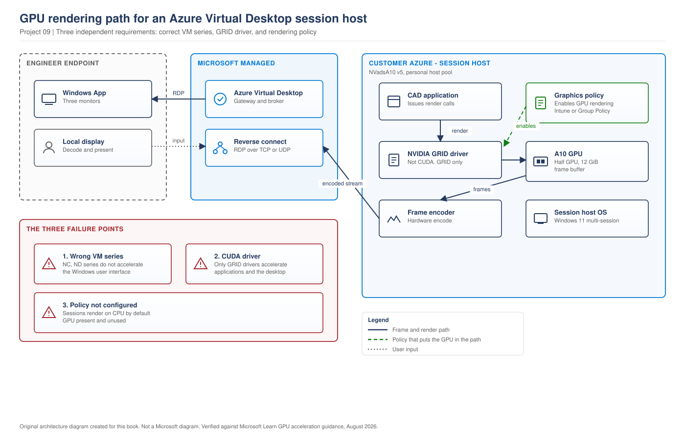
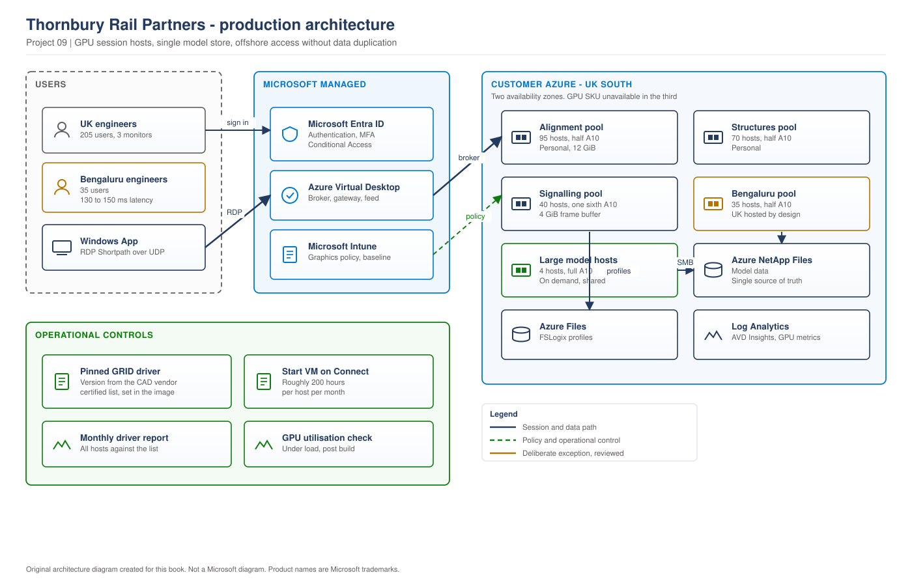

# Project 09 - Thornbury Rail Partners: CAD, GPU and the Cost of Getting Drivers Wrong

> **Fictional architecture case study:** Thornbury Rail Partners is not a customer delivery record. Requirements, measurements, costs, tests, and outcomes are worked examples or validation targets unless separate lab evidence is linked.

> **Book:** Azure Virtual Desktop - Architect to Hands-on Implementation
> **Part XI:** Architecture Case Studies
> **Standard:** [PROJECT-STANDARD.md](../PROJECT-STANDARD.md)
> **Technical baseline:** August 2026
> **Concepts introduced here:** GPU VM series selection for AVD, GRID against CUDA drivers, enabling GPU rendering, fractional GPU sizing by frame buffer, vendor driver certification, GPU capacity and quota

---

## Engagement brief

**What this represents.** An engineering consultancy moving CAD from physical workstations to AVD. GPU workloads are the one AVD population where the platform can be deployed entirely correctly and deliver nothing, because GPU acceleration is off by default and nobody notices until an engineer says it feels slower than their laptop.

**The business problem.** Thornbury has 240 design engineers across three UK offices and a growing design team in Bengaluru. Physical workstations cost £4,200 each on a three year cycle, they cannot be shared between the UK and India teams, and the Bengaluru team currently works on copies of models transferred nightly, which has caused two version control incidents in a year.

**Constraints that cannot be designed away.** The CAD vendor certifies specific graphics driver versions and will not support the product outside that list. Large rail alignment models take four to six minutes to open, and that number is watched. Engineers work with three monitors. And GPU capacity in Azure is not guaranteed, which [Chapter 17](../chapters/ch17-session-host-sizing-compute-selection.md#5-gpu-and-capacity-planning) established and this engagement had to live with.

**Previously learned concepts applied.** Sizing and GPU basics ([Chapter 17](../chapters/ch17-session-host-sizing-compute-selection.md)), personal against pooled ([Chapter 15](../chapters/ch15-host-pool-design-decisions.md)), image strategy ([Chapter 23](../chapters/ch23-golden-image-engineering.md)), protocol and multi-monitor considerations ([Chapter 14](../chapters/ch14-protocol-optimisation-network-performance.md)), personal pool power management ([Project 08](project-08-developer-engineering.md)).

**New concepts introduced here.** GPU VM series selection for session hosts and which series are unsuitable. GRID against CUDA drivers and why the distinction decides whether anything works. Enabling GPU rendering, which is not on by default. Fractional GPU sizing by frame buffer rather than by vCPU. Vendor driver certification as a change control constraint. GPU capacity and quota in practice.

**Architectural decisions to make.** Which GPU series. Fractional or whole GPU per engineer. Personal or pooled. How to handle a vendor-certified driver list against a monthly image cycle. Where to put the Bengaluru team.

**What could realistically go wrong.** GPU hosts delivering CPU rendering. A driver update breaking vendor support. A region with no GPU capacity on the day you need it.

**Validation and handover.** Model open times measured against the physical workstation baseline, by engineers using real project files.

---

## 1. The workload

**Thornbury Rail Partners.** Rail infrastructure design. 240 design engineers plus 180 non-design staff who are already on standard AVD.

| Team | Engineers | Location | Workload |
|---|---|---|---|
| Alignment and civils | 95 | Birmingham, Leeds | Large 3D alignment models, 4 to 8 GB working sets |
| Structures | 70 | Birmingham | Structural models, heavy rendering |
| Signalling and systems | 40 | Leeds, Glasgow | 2D and light 3D, schematic work |
| Bengaluru design team | 35 | Bengaluru | Same as alignment and civils |


> **EXAMPLE CUSTOMER ARCHITECTURE.** Thornbury Rail Partners as found. Created for this book.
**What makes CAD different from every other AVD workload.**

**Frame buffer, not vCPU.** A CAD session's limit is usually GPU memory, because the model is held in the frame buffer. A host with plenty of CPU and insufficient frame buffer produces an application that opens the model and then fails or crawls.

**Interactive, not throughput.** A build can take four minutes and nobody minds. A 200 millisecond delay when rotating a model is intolerable, and engineers will describe it as unusable rather than slow.

**Three monitors as standard.** Which multiplies the encoding work and the bandwidth per user.

**Vendor certification.** The CAD vendor publishes a list of certified graphics driver versions. Running outside it means no support on a product the business depends on.

---

## 2. Requirements

| ID | Requirement | Source | Test |
|---|---|---|---|
| BR1 | Bengaluru team works on the same models as the UK, no nightly copies | Design director, after two version incidents | Engineers in both locations open the same model from the same store |
| BR2 | Cost within 20 percent of the physical workstation refresh | Finance | Monthly cost against amortised refresh |
| BR3 | Remain within CAD vendor support | Engineering director | Driver version on every host matches the certified list |
| TR1 | Large model open time no worse than the physical workstation | Engineering | Measured with real project files, 20 samples |
| TR2 | Interactive rotation of a large assembly without visible lag | Engineering | Assessed by three engineers on real models |
| TR3 | Three monitors supported at native resolution | Engineering | Verified per engineer |
| TR4 | Model data does not leave the UK for non-UK staff without control | Contractual, some clients | Access path documented and evidenced |

**BR1 is the business driver and TR1 is the acceptance test.** If models open slower than on a workstation, engineers reject the platform regardless of what BR1 delivers, and the 2019 pattern from [Project 08](project-08-developer-engineering.md) repeats.

**TR4 is quieter and it constrained the design.** Some Thornbury clients have contractual restrictions on where design data is accessed. Not all, and the ones that do are named in the contract.

---

## 3. Concept introduced: GPU on AVD, and the three ways it goes wrong

Three separate things must be right. Getting two of three produces a platform that costs GPU money and performs like a CPU.

### Choose a series intended for graphics

Microsoft is direct about which series are unsuitable: Azure NC, NCv2, NCv3, ND, and NDv2 series VMs aren't generally appropriate as session hosts. These VM sizes are tailored for specialized, high-performance compute or machine learning tools, such as those built with NVIDIA CUDA. They don't support GPU acceleration for most applications or the Windows user interface.

**That sentence prevents a common and expensive mistake.** An NC series VM is a GPU VM, it is more expensive than a general purpose VM, and it will not accelerate a CAD application or the Windows desktop.

### Install GRID drivers, not CUDA

This is the distinction that decides whether the GPU does anything useful.

For VMs sizes with an NVIDIA GPU, only NVIDIA GRID drivers support GPU acceleration for most applications and the Windows user interface. NVIDIA CUDA drivers don't support GPU acceleration for these VM sizes.

And on supportability: only drivers distributed by Azure are supported for AVD, and for NVIDIA GPUs only the GRID drivers.

**The extension usually does the right thing.** For NVadsA10 v5 the NVIDIA GPU Driver Extension installs the GRID driver automatically. For some other series the same extension installs CUDA drivers, which is correct for compute workloads and wrong for a session host. `[VERIFY BEFORE IMPLEMENTATION]` confirm which driver the extension installs for the specific series you have chosen, because the answer differs by series.

**One more version dependency worth recording.** For HEVC/H.265 hardware acceleration, you must use NVIDIA GPU driver GRID 16.2 (537.13) or later.

### Turn GPU rendering on

The one that catches people, because everything looks correct.

Microsoft states the default plainly: by default, Azure Virtual Desktop remote sessions are rendered with the CPU and don't use available GPUs.

**Deploying GPU hosts is not enough.** GPU-accelerated rendering, frame encoding and full screen video encoding are enabled through Group Policy or Intune policy on the session hosts. Without that configuration you have paid for GPUs and rendered on CPU, and section 8 is about exactly that happening.

**Configuration paths.** Intune Settings catalog or Group Policy, under Remote Desktop Session Host graphics settings. `[VERIFY BEFORE IMPLEMENTATION]` take the current setting names from the Microsoft GPU acceleration guidance, because they have changed with Windows versions.

**How to prove it is working.** Not by asking a user whether it feels faster. In a session, open Task Manager and check GPU utilisation on the Performance tab while manipulating a model, and confirm the driver with `nvidia-smi` on the host.

```bash
az vm run-command invoke -g rg-thb-gpu-prd-uks-01 -n <vm> \
  --command-id RunPowerShellScript \
  --scripts "& 'C:\Windows\System32\DriverStore\FileRepository\nvgrid*\nvidia-smi.exe'; Get-WmiObject Win32_VideoController | Select-Object Name, DriverVersion"
```

`[VERIFY BEFORE IMPLEMENTATION]` The `nvidia-smi` path varies by driver package. Confirm on a host before scripting it.

---

## 4. Concept introduced: sizing by frame buffer

Standard AVD sizing starts from vCPU and memory ([Chapter 17](../chapters/ch17-session-host-sizing-compute-selection.md#2-a-sizing-method-you-can-defend)). GPU sizing starts from frame buffer, and Azure now lets you buy a fraction of a GPU.

Microsoft describes the NVadsA10 v5 series: the NVadsA10v5-series virtual machines are powered by NVIDIA A10 GPUs and AMD EPYC 74F3V (Milan) CPUs. With NVadsA10v5-series Azure is introducing virtual machines with partial NVIDIA GPUs. Pick the right sized virtual machine for GPU accelerated graphics applications and virtual desktops starting at 1/6th of a GPU with 4-GiB frame buffer to a full A10 GPU with 24-GiB frame buffer.

And on licensing, which removes a cost line people expect: each virtual machine instance in NVadsA10v5-series comes with a GRID license. This license gives you the flexibility to use an NV instance as a virtual workstation for a single user, or 25 concurrent users can connect to the VM for a virtual application scenario.

**The sizing method that follows.**

1. Measure the working set of a representative model in GPU memory on a physical workstation.
2. Add headroom for the Windows desktop, three monitors and the application's own overhead.
3. Choose the fraction of a GPU that provides that frame buffer.
4. Check that the vCPU and memory that come with that fraction are adequate, because they scale together.
5. Test with real models before committing.

**One constraint to note.** The NVadsA10 v5 series does not support nested virtualisation. That is irrelevant for CAD and it would matter for a developer workload, which is why [Project 08](project-08-developer-engineering.md) has a separate GPU pool rather than putting its ML engineers on the CAD hosts.

---

## 5. Architecture decisions

### AD1: GPU series

**Decision. NVadsA10 v5.**

**Reason.** It is intended for virtual workstations, the GRID driver is installed by the extension, the GRID licence is included, and fractional sizing means the signalling team does not have to pay for a whole GPU.

**Rejected alternatives.**

NC series, rejected on Microsoft's own guidance that it is not appropriate as a session host and does not accelerate the Windows user interface.

NVv3 and NVv4, rejected on lifecycle. `CURRENCY FLAG - verified August 2026.` Both series have been scheduled for retirement, with guidance to migrate to newer series. `[VERIFY BEFORE IMPLEMENTATION]` confirm the current retirement dates and the recommended replacement series before selecting a GPU size, because choosing a series near end of life on a three year platform is a self-inflicted migration.

### AD2: Fractional or whole GPU

Sizing came from measurement on physical workstations, not from a table.

| Team | Measured frame buffer at peak | GPU fraction chosen | Type |
|---|---|---|---|
| Alignment and civils | 9 to 14 GB on large models | 1/2 A10, 12 GiB | Decision, after testing |
| Structures | 7 to 11 GB | 1/2 A10, 12 GiB | Decision |
| Signalling and systems | 2 to 4 GB | 1/6 A10, 4 GiB | Decision |

**The alignment team's number is the interesting one.** Peak measured 14 GB, which is above the 12 GiB the half GPU provides. Testing with the three largest live project models showed the application managing within 12 GiB with a modest performance cost on the very largest, and the alternative was a whole A10 at roughly double the price for every engineer.

**The decision made and how it was defended.** Half a GPU for the alignment team, plus four hosts with a whole A10 held as a shared resource for the handful of models that genuinely need it. Engineers request a session on those hosts for a specific piece of work.

**Why this is better than sizing everyone for the worst case.** Fewer than 5 percent of tasks need more than 12 GiB. Sizing 95 engineers for the 5 percent case would have cost roughly £18,000 a month for capacity used a few hours a week.

**The risk accepted.** An engineer occasionally has to move to a larger host mid-task, which is friction. It was accepted by the engineering director on the basis of the measurement, and the request process was made simple enough that it is not a barrier.

### AD3: Personal or pooled

**Decision. Personal host pools.**

**Reason.** Same reasoning as [Project 08](project-08-developer-engineering.md#4-architecture-decisions). Interactive graphics performance degrades noticeably when a GPU is shared between concurrent users, and engineers keep local caches and application configuration.

**But note the licensing nuance.** The GRID licence permits a single user as a virtual workstation or 25 concurrent users for virtual applications. Pooled would have been permitted. It was rejected on performance, not licensing.

**The cost consequence.** Personal GPU hosts are the most expensive per-user configuration in this book, and power management is the only lever. Start VM on Connect plus scheduled deallocation, as in [Project 08](project-08-developer-engineering.md#5-sizing-and-the-cost-problem), with the same cold start trade.

### AD4: Where the Bengaluru team runs

**Requirement.** BR1 says one set of models. TR4 says some client data has access restrictions.

**Options.** Session hosts in India Central with models replicated. Session hosts in UK South with engineers connecting from Bengaluru. Split by project.

**Decision. Session hosts in UK South for the Bengaluru team, with a documented exception process for latency-sensitive work.**

**Reason.** BR1 is the business driver and it means one copy of the model data. Replicating design data to India would have reintroduced the version control problem the project exists to solve, and it would have breached TR4 for the restricted clients.

**The cost.** Latency from Bengaluru to UK South, measured at 130 to 150 milliseconds during the pilot. That is noticeable for interactive 3D work.

**What made it acceptable.** Three things. RDP Shortpath established over UDP for the Bengaluru users, which matters more at that latency than at 20 milliseconds ([Chapter 14](../chapters/ch14-protocol-optimisation-network-performance.md#1-how-the-transport-is-chosen)). Protocol tuning for the graphics workload. And an honest conversation with the Bengaluru team, who accepted it once they understood the alternative was continuing to work on copies.

**This is the decision that goes against the obvious answer.** Standard guidance is to place session hosts close to users. We deliberately did not, because data location mattered more than latency for this workload, and we said so with a measured number rather than hoping nobody noticed.

**Review trigger.** If a client with no data restriction becomes a large enough share of the Bengaluru team's work, a second pool in India Central for that work becomes justifiable.

---

## 6. The rendering path

> **RECOMMENDED ARCHITECTURE.** How a frame reaches an engineer, and where the three failure points are.

> **OUR ORIGINAL ARCHITECTURE DIAGRAM.** Created for this book. Not a Microsoft diagram.
> Editable source: [`project09-02-gpu-rendering-path.drawio`](../diagrams/architecture/project09-02-gpu-rendering-path.drawio), which uses the Azure shape library in diagrams.net.



**What this shows.** The path a frame takes from the CAD application to the engineer's monitors, and the policy that has to be in place for the GPU to be in that path at all.

**The three failure points, in order of how often they occur.**

**Graphics policy not configured.** The GPU exists and is not used, because rendering defaults to CPU. Section 8.

**Wrong driver.** CUDA installed rather than GRID. The GPU is present, `nvidia-smi` works, and applications and the Windows interface are not accelerated.

**Wrong series.** An NC series host, where GRID acceleration for the desktop is not available at all.

**What the diagram does not show, and matters.** Encoding is work. Three monitors at high resolution is significantly more encoding than one, which is why TR3 affected the sizing decision as well as the protocol configuration.

---

## 7. Vendor certification against a monthly image cycle

This is the operational conflict specific to CAD, and it does not exist for any other workload in this book.

**The problem.** The CAD vendor certifies specific graphics driver versions. The image cycle from [Chapter 23](../chapters/ch23-golden-image-engineering.md) rebuilds monthly from a clean source, and the driver extension installs the current driver. Left alone, a monthly image rebuild silently moves the estate outside vendor support.

**What Thornbury does.**

| Rule | Detail |
|---|---|
| Driver version is pinned in the image build | The build installs a specific certified version, not the latest |
| The certified list is checked quarterly | Against the vendor's published list, by the applications team |
| Driver changes are a separate change | Never bundled with an image update. Own testing, own approval |
| Driver testing uses real project models | Three named models, three engineers, documented result |
| The current version is recorded per host pool | Reported monthly alongside patch level |

**Why driver changes are separated from image updates.** If a monthly image update also changed the driver, a rendering problem after the update has two candidate causes and the investigation doubles. Separating them means a driver problem is attributable.

**The tension this creates.** Security wants current drivers. The vendor certifies older ones. Thornbury's position is that the certified list is the constraint, that the gap is tracked, and that a security-relevant driver update triggers a conversation with the vendor rather than a unilateral upgrade. That was agreed in writing between the engineering director and the security lead, which is what stops it being re-argued every quarter.

---

## 8. L3 incident: GPU hosts rendering on CPU

**Incident.** Pilot engineers report that model manipulation feels no better than the old Citrix platform and worse than their workstations. The hosts are GPU hosts and the pilot is three days from its go or no-go decision.

**Impact.** The pilot is at risk. Nine engineers, but the decision affects a 240 engineer programme and the engineering director's confidence in it.

**Scope.** All GPU hosts in the pilot pool. Consistent, not intermittent.

**Initial triage.** Consistent across all hosts points at configuration rather than a fault. Two candidates: the driver, or GPU rendering not being enabled.

**Evidence collection.** On a pilot host, confirm the GPU is present and which driver is installed:

```bash
az vm run-command invoke -g rg-thb-gpu-prd-uks-01 -n <vm> \
  --command-id RunPowerShellScript \
  --scripts "Get-WmiObject Win32_VideoController | Select-Object Name, DriverVersion, Status; Get-CimInstance Win32_PnPSignedDriver | Where-Object DeviceName -like '*NVIDIA*' | Select-Object DeviceName, DriverVersion"
```

The A10 is present and a GRID driver is installed. So the first candidate is eliminated.

Then, in a live session with an engineer manipulating a model, check Task Manager on the Performance tab. GPU utilisation is close to zero while CPU is high.

Then check the graphics policy state on the host.

**Hypothesis.** GPU rendering is not enabled. Remote sessions default to CPU rendering, so a correctly built GPU host with the correct driver still renders on CPU until policy says otherwise.

**Testing.** Apply the graphics policy to one host, restart it, and repeat the same model manipulation with the same engineer and the same file. GPU utilisation rises and the engineer reports the difference immediately without being told what changed, which is the test worth doing.

**Root cause.** The build process installed the driver through the extension and nobody configured the policy that enables GPU-accelerated rendering and encoding. The documentation says clearly that sessions render with the CPU by default. It was read as a statement about non-GPU hosts.

**Remediation.** Graphics policy deployed through Intune to the GPU device group, covering GPU-accelerated rendering and frame encoding. Applied to all pilot hosts and added to the build standard.

**Validation.** Model open times measured against the physical workstation baseline with the same three project files, by the same engineers, before and after. Not a subjective assessment.

| Model | Physical workstation | GPU host, CPU rendering | GPU host, GPU rendering |
|---|---|---|---|
| Alignment, 4.2 GB | 3m 50s | 6m 20s | 3m 35s |
| Structures, 2.8 GB | 2m 30s | 4m 05s | 2m 20s |
| Signalling, 0.9 GB | 55s | 1m 10s | 50s |

**TR1 met after the fix and failed badly before it.**

**Rollback.** Not required. The change was additive and improved every measure.

**Prevention.** Graphics policy is in the build standard and in Intune, applied by device group so a new host receives it without depending on the image. Post-build validation includes a GPU utilisation check under load, not just a driver presence check. The distinction matters: driver present and GPU idle is exactly the state that caused this.

**Runbook update.** New KB: "GPU host performs like a CPU host." Check order is driver presence, driver type GRID rather than CUDA, then graphics policy, then GPU utilisation under load. The last step is the only one that proves it.

**Lesson.** GPU on AVD has three independent requirements: the right series, the right driver and the policy that puts the GPU in the rendering path. Two out of three produces a platform that costs GPU money and performs like CPU, with no error anywhere to indicate it.

---

## 9. L3 incident: a driver update breaks vendor support and then breaks a model

**Incident.** Four weeks after go-live for the structures team, engineers report the CAD application crashing when opening two specific large assemblies. Other models are fine. The crash is reproducible.

**Impact.** Nine structures engineers unable to work on a client deliverable with a fixed submission date. The vendor's first response to the support call was to ask for the graphics driver version.

**Scope.** Structures team hosts only. Alignment team hosts, built earlier, unaffected. Same application version on both.

**Initial triage.** Same application, different hosts, different behaviour. That points at the host build rather than the application, and the vendor's question pointed at the driver.

**Evidence collection.** Compare the driver version on a working and a failing host:

```bash
az vm run-command invoke -g rg-thb-gpu-prd-uks-01 -n <vm> \
  --command-id RunPowerShellScript \
  --scripts "Get-CimInstance Win32_PnPSignedDriver | Where-Object DeviceName -like '*NVIDIA*' | Select-Object DeviceName, DriverVersion, DriverDate"
```

Then check which image version each host was built from:

```bash
az vm list -g rg-thb-gpu-prd-uks-01 \
  --query "[].{name:name, image:storageProfile.imageReference.exactVersion}" -o table
```

**Evidence.** The structures hosts were built from an image produced two weeks later than the alignment hosts, and carry a newer GRID driver. That driver version is not on the CAD vendor's certified list.

**Hypothesis.** The image rebuild installed the current driver through the extension rather than the pinned certified version, moving those hosts outside vendor support and introducing a rendering defect that affects large assemblies specifically.

**Testing.** Roll one structures host back to the certified driver version and reopen both failing assemblies. Both open successfully.

**Root cause.** The driver pinning rule from section 7 existed in the design and had not been implemented in the image build. The build called the driver extension without specifying a version, so it installed whatever was current at build time. The alignment hosts happened to be built when the current version was the certified one.

**Remediation.** Immediate: rebuild the structures hosts from an image with the certified driver version. Nine hosts, done overnight, personal pools so each engineer's work was preserved as described in [Project 08](project-08-developer-engineering.md#7-image-and-drift).

Then fix the build to install the specific certified version rather than the current one.

Then verify every host in the estate reports the certified version, because the two alignment hosts built most recently were also outside the list and had simply not hit a model that exposed it.

**Validation.** Both assemblies open on rebuilt hosts. Driver version confirmed on all 47 GPU hosts, not a sample, because the whole point of the incident was that a subset had drifted. Vendor support case closed with the certified version confirmed.

**Rollback.** The rebuild was itself the rollback, to a known-good image.

**Prevention.** Driver version pinned in the image build with the version as an explicit parameter. A monthly check that reports the driver version across all GPU hosts against the certified list. Driver changes separated from image updates, as section 7 always intended and had not enforced.

**Runbook update.** KB entry: "CAD application fails on specific models." First check is driver version against the certified list, then which image version the host was built from. The second question usually explains the first.

**Lesson.** A design rule that is not implemented in the build is not a rule. Section 7 was written before go-live and everyone agreed with it, and the image build did not enforce it, so it protected nothing. The gap between an agreed standard and an enforced one is where this class of incident lives.

---

## 9a. Production architecture

> **RECOMMENDED ARCHITECTURE.** Thornbury Rail Partners production design. Created for this book. Not a Microsoft reference architecture.
> Editable source: [`project09-03-production-architecture.drawio`](../diagrams/architecture/project09-03-production-architecture.drawio)



**What this shows.** Four GPU host pools sized by frame buffer rather than by vCPU, a single model store in Azure NetApp Files that both the UK and Bengaluru teams work from, and the operational controls that keep the estate inside vendor support.

**The data decision is visible.** Both the UK pools and the Bengaluru pool point at the same model store. That is BR1, and it is the reason the Bengaluru team accepted UK-hosted session hosts and 130 to 150 milliseconds of latency.

**The operational controls are drawn deliberately.** A pinned GRID driver, Start VM on Connect, and the two checks that catch the failures in sections 8 and 9. Every one of them exists because of an incident rather than a preference.

**Where it fails.** Two availability zones rather than three, because the GPU size was restricted in the third. Loss of the model store stops design work for everyone, which is the cost of a single source of truth and is accepted deliberately.

---

## 10. Cost and capacity

### Capacity came first

Before any sizing work, GPU quota and SKU availability should be checked in the target region, following the lesson from [Chapter 17](../chapters/ch17-session-host-sizing-compute-selection.md#6-production-scenarios).

```bash
az vm list-usage --location uksouth -o table | grep -i "NVADS"
az vm list-skus --location uksouth --size Standard_NV --all -o table
```

**What was found.** Sufficient quota after a request, and availability restrictions in one of the three availability zones for the size required. That shaped the placement: two zones rather than three for the GPU pools, which is a resilience reduction accepted and documented rather than discovered later.

**A fallback region was named in the design document** before build started. It was not needed and it took twenty minutes to identify.

### Cost

`[VERIFY BEFORE IMPLEMENTATION]` Indicative shapes, UK South at design time.

| Line | Detail | Monthly |
|---|---|---|
| Alignment and civils | 95 hosts, half A10, roughly 200 hours each | £41,300 |
| Structures | 70 hosts, half A10 | £30,400 |
| Signalling | 40 hosts, 1/6 A10 | £6,900 |
| Bengaluru | 35 hosts, half A10, different hours | £14,200 |
| Shared large-model hosts | 4 hosts, full A10, on demand | £3,600 |
| Premium SSD disks, 244 hosts | | £9,800 |
| Storage for model data | Azure NetApp Files | £6,400 |
| Networking, monitoring, other | | £2,900 |
| **Total** | | **£115,500** |

**Against the physical alternative.** 240 workstations at £4,200 on a three year cycle is roughly £28,000 a month amortised, plus a refresh programme, plus the Bengaluru copy process and its incidents.

**AVD is roughly four times the hardware cost, and it was approved.** BR2 asked for within 20 percent and was not met, which is stated plainly rather than adjusted.

**Why it went ahead anyway.** Two reasons the business weighed and we did not. Removing the nightly model copy eliminated a version control risk that had already caused two incidents, one of which involved reissuing a client deliverable. And the Bengaluru team could be scaled up and down with demand, where workstations could not, which mattered more to the business than the monthly figure.

**The honest framing given to the board.** This is not a cost saving. It buys a single source of truth for design data and elastic capacity for the offshore team, and it costs roughly £87,000 a month more than the hardware it replaces.

**Where the cost lever is.** Power management, as with any personal pool. Moving from always-on to Start VM on Connect with scheduled deallocation took the estate from an effective 730 hours to roughly 200 per host, which is the difference between the number above and something close to four times it.

---

## 11. Day-2 operations

**GPU-specific additions to the standard operating model.**

| Cadence | Activity |
|---|---|
| Monthly | Driver version report across all GPU hosts against the certified list |
| Monthly | GPU utilisation sampling under real load, to catch policy drift |
| Quarterly | Vendor certified driver list reviewed for changes |
| Quarterly | GPU quota and SKU availability re-checked before any expansion |
| Annually | GPU series lifecycle checked against Azure retirement announcements |

**The annual series lifecycle check exists because of AD1.** A GPU series reaching end of life is a platform migration, and finding out with six months' notice is uncomfortable. Finding out with two years is a plan.

```
Runbook: Graphics driver change
Trigger:        Vendor certifies a new driver version, or a security advisory
Owner:          Applications team, with engineering sign-off
Prerequisites:  Certified version confirmed, test models available
Impact:         Hosts rebuilt. Engineer work preserved, session interrupted
Rollback:       Rebuild from the previous image version
Steps:
  1. Confirm the version appears on the vendor certified list
  2. Build an image with the driver version pinned explicitly
  3. Deploy two test hosts
  4. Three named engineers open three named project models and report
  5. Confirm GPU utilisation under load on the test hosts
  6. Engineering director signs off
  7. Roll out to one team, wait one week, then the remainder
Validation:     Driver version confirmed on every host. No model failures reported for two weeks
Escalation:     Any model failure stops the rollout immediately
```

**Step 5 is there because of section 8.** A driver change is an opportunity for the graphics policy to stop taking effect, and checking utilisation rather than presence is what catches it.

---

## 12. Trade-offs

| Trade-off | Given up | Why | What would change it |
|---|---|---|---|
| Half A10 rather than whole | Headroom on the largest 5 percent of models | Roughly £18,000 a month for capacity used a few hours a week | Models growing so the 5 percent becomes 30 percent |
| Four shared full-GPU hosts | Simplicity | Covers the exception without sizing everyone for it | Demand for those hosts becoming routine rather than occasional |
| Bengaluru on UK hosts | Latency, measured at 130 to 150 milliseconds | BR1 and TR4. One copy of model data | A large body of unrestricted client work justifying an India pool |
| Two availability zones for GPU pools | Zone resilience | SKU availability in the third zone | Availability changing, which is worth re-checking annually |
| Driver pinned to the certified list | Current security patches on the graphics driver | Vendor support on a business-critical application | A vendor certifying more promptly, or a security advisory forcing the conversation |
| Personal pools | Density, and a large cost | Interactive graphics degrade when a GPU is shared | A workload that is not interactive |
| Cost four times the hardware | The financial case | Single source of design truth and elastic offshore capacity | Nothing. It was presented as a capability purchase from the start |

**The one that will be challenged.** Cost. BR2 asked for within 20 percent of the hardware refresh and the answer is roughly 400 percent. The defence is that the business chose it with the number in front of them, for reasons that were not cost, and that presenting it as a saving would have collapsed at the first invoice. The alternative, keeping workstations, was on the table until the board made that decision.

---

## 13. Interview questions from this engagement

### Q. How do you design AVD for CAD?

**Strong answer**
"Three things have to be right before anything else matters. A GPU series intended for graphics, because Microsoft is explicit that NC and ND series are not appropriate as session hosts and do not accelerate the Windows interface. GRID drivers rather than CUDA, because only GRID supports acceleration for applications and the desktop. And the policy that enables GPU rendering, because AVD sessions render with the CPU by default. Getting two out of three gives you a platform that costs GPU money and performs like a CPU, with no error to tell you. Then sizing starts from frame buffer rather than vCPU, because a CAD model lives in GPU memory, and fractional GPUs mean you can buy a sixth of an A10 for schematic work and a half for large 3D."

**Follow-up you should expect**
"How would you prove GPU acceleration is working?" Not by asking a user. GPU utilisation in Task Manager while a model is being manipulated, and driver type confirmed on the host. Driver present with GPU idle is exactly the failure state.

### Q. How do you handle a CAD vendor's certified driver list against a monthly image cycle?

**Strong answer**
"Pin the driver version in the image build, explicitly, rather than calling the driver extension and taking whatever is current. That is a rule that has to be implemented in the build, not just written in a standard, and at this customer it was written and not implemented, which put nine engineers outside vendor support and broke two large assemblies four weeks after go-live. Then separate driver changes from image updates entirely, so that a rendering problem after a change has one candidate cause rather than two. Then a monthly report of driver version across all GPU hosts against the certified list, because drift only shows up when a model exposes it. And the security tension is real: the vendor certifies older drivers than security would like, so that gap is tracked and a security advisory triggers a vendor conversation rather than a unilateral upgrade."

### Q. Where would you put session hosts for an offshore design team?

**Strong answer**
"Normally close to the users, and at this customer I deliberately did not. The business driver was a single copy of design data, because the offshore team had been working on nightly copies and it had caused two version control incidents including a reissued client deliverable. Replicating the models to India would have reintroduced exactly that, and some clients have contractual restrictions on where design data is accessed. So the Bengaluru team connects to UK hosts at 130 to 150 milliseconds, which is noticeable for interactive 3D. What made it work was Shortpath over UDP, which matters far more at that latency than at 20, protocol tuning, and an honest conversation with the team about the alternative. I would rather present a measured latency number and the reason than hope nobody notices."

### Q. Was it cheaper than workstations?

**Honest answer**
"No, and by a wide margin. Roughly £115,500 a month against about £28,000 a month amortised for 240 workstations. The requirement asked for within 20 percent and we did not meet it. The board approved it anyway for two reasons that were not cost: a single source of truth for design data, which removed a risk that had already caused a client deliverable to be reissued, and the ability to scale the offshore team up and down, which hardware cannot do. I presented it as a capability purchase from the start. If I had framed it as a saving it would have collapsed at the first invoice, and the credibility loss would have been worse than the cost."

### Q. What would you do differently?

**Honest answer**
"I would have implemented the driver pinning rule in the image build at the same time as writing it. It was in the design, everyone agreed with it, and the build called the extension without a version, so the rule protected nothing until an incident forced it. And I would have put GPU utilisation under load into the post-build validation from day one rather than after the pilot nearly failed. Both mistakes are the same shape: a control that existed as a statement rather than as something the platform enforced."

---

## Project Self-Review

**Pass 1, technical verification.** The statement that NC, NCv2, NCv3, ND and NDv2 series are not generally appropriate as session hosts and do not support GPU acceleration for most applications or the Windows user interface, the requirement for NVIDIA GRID drivers rather than CUDA drivers, the GRID 16.2 (537.13) requirement for HEVC hardware acceleration, and the default that AVD remote sessions are rendered with the CPU and do not use available GPUs were verified against the current Microsoft enable GPU acceleration guidance. The NVadsA10 v5 fractional GPU range from one sixth of a GPU with 4 GiB frame buffer to a full A10 with 24 GiB, the included GRID licence and its single virtual workstation or 25 concurrent user application scenarios, and the lack of nested virtualisation support were verified against the NVadsA10 v5 series documentation. Driver extension behaviour by series, the `nvidia-smi` path, graphics policy setting names, and NVv3 and NVv4 retirement dates all carry verification markers, the last with a currency flag because it comes from a third-party source rather than a Microsoft page. Cost figures carry a verification marker.

**Pass 2, human readability review.** Written in engagement order, with the three GPU failure points established before any design decision, because the pilot nearly failed on one of them. The cost section states plainly that the requirement was not met, which is the honest position. Sentences kept short. No long dash characters. Read back as an architect handed a CAD population, and the frame buffer sizing concept was moved ahead of the decisions, because the sizing table is meaningless without it.

**Pass 3, visual and topic accuracy review.** Three diagrams, produced as SVG rather than Mermaid, because Mermaid cannot express the zone, tile and legend grammar an Azure architecture diagram needs. Current state shows why the migration is happening, including the nightly copy that caused two version incidents. The rendering path shows where the GPU sits between the application and the encoder and where policy has to act for it to be in that path, with the three failure points drawn as a separate band. Production architecture shows the finished platform, the single model store both regions work from, and the operational controls. Each diagram carries a title, a subtitle, a legend and a provenance note. Editable draw.io sources using the Azure shape library accompany two of them. Topic test applied to each: none reads as a generic AVD diagram.

**Concepts introduced, for the coverage map.** GPU VM series selection and unsuitable series. GRID against CUDA drivers. Enabling GPU rendering, which is off by default. Fractional GPU sizing by frame buffer. Vendor driver certification as change control. GPU quota and capacity checking before design.

| Standard check | Result |
|---|---|
| Engagement brief answering all eight questions | Yes |
| Real numbers, typed | Yes. Frame buffer, model open times, latency, cost |
| Competing requirements resolved | Data location against latency, cost against capability |
| Constraints that cannot be designed away | Vendor certified driver list, GPU capacity, client data restrictions |
| Decision against the obvious answer | Offshore team on UK hosts rather than local hosts |
| Problems that actually happen | GPU hosts rendering on CPU, driver drift breaking vendor support |
| Operational ownership addressed | Driver change runbook, monthly driver report, annual series lifecycle check |
| L3 incident workflow complete | Two incidents run incident to KB update, with measured validation |
| Cost treated honestly | Yes. The requirement was not met and that is stated |
| No repetition of concept chapters | Checked. GPU basics, personal pools and image strategy referenced |
