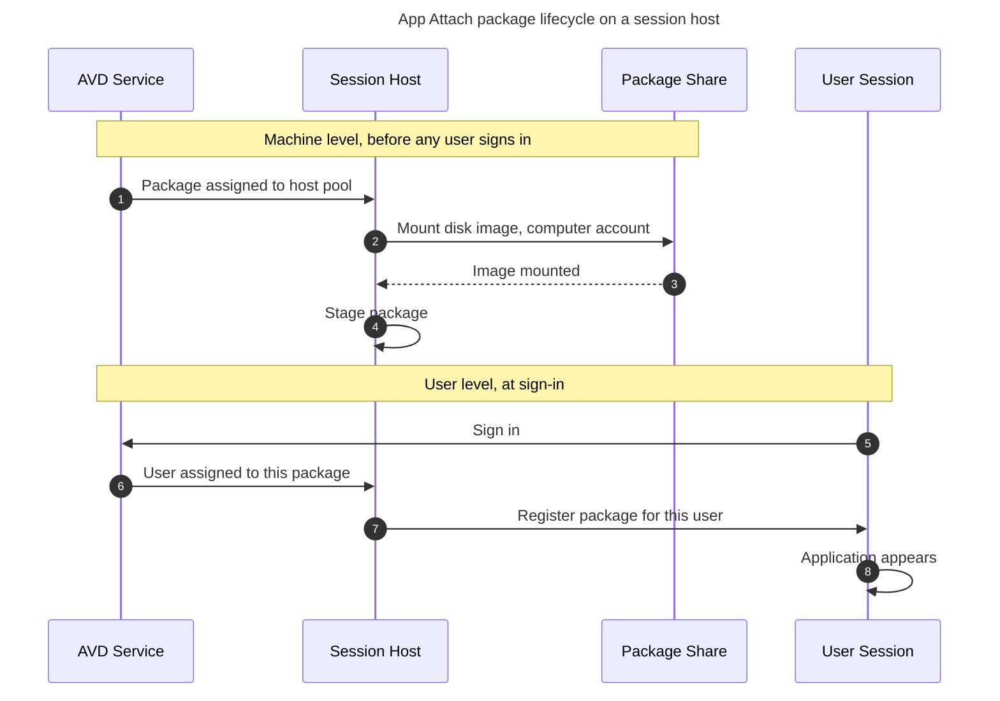
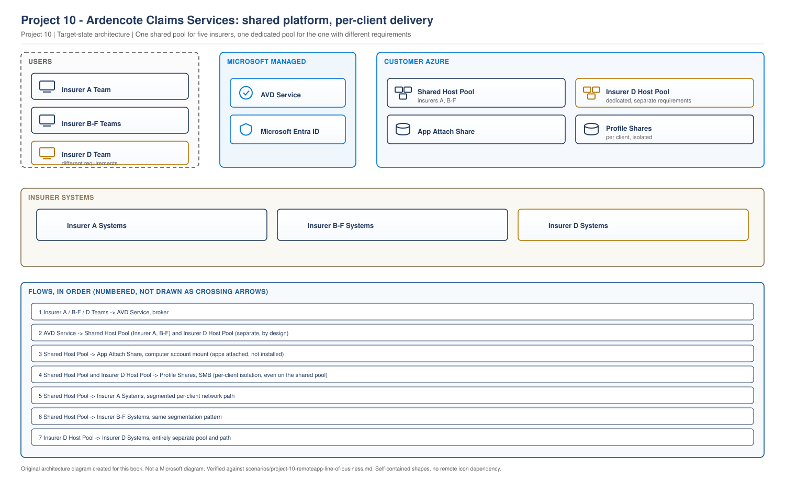

# Project 10 - Ardencote Claims Services: RemoteApp, Six Clients, One Platform

> **Fictional architecture case study:** Ardencote Claims Services is not a customer delivery record. Requirements, measurements, costs, tests, and outcomes are worked examples or validation targets unless separate lab evidence is linked.

> **Book:** Azure Virtual Desktop - Architect to Hands-on Implementation
> **Part XI:** Architecture Case Studies
> **Standard:** [PROJECT-STANDARD.md](../PROJECT-STANDARD.md)
> **Technical baseline:** August 2026
> **Concepts introduced here:** App Attach packaging in practice, code signing and certificate trust, CimFS against VHDX, staging and registration, open handle behaviour on the package share, per-user application segregation

---

## Engagement brief

**What this represents.** A business process outsourcer delivering different applications to different client teams from one platform, where the segregation is contractual rather than technical preference. This is the engagement where App Attach stops being a nice idea and becomes the only workable answer.

**The business problem.** Ardencote handles claims for six insurers. Each insurer supplies its own claims application, and each contract states that Ardencote staff working for one insurer must not have access to another insurer's systems or data. Today that is achieved with six separate host pools and six images, which costs money and takes six weeks to onboard a new client.

**Constraints that cannot be designed away.** The segregation requirement is contractual and audited annually. Two of the six applications are supplied as installers by the insurer and cannot be modified. One insurer's application is licensed per device. New client onboarding has a contractual 20 working day SLA that Ardencote currently misses.

**Previously learned concepts applied.** Application delivery routes and RemoteApp publishing ([Chapter 25](../chapters/ch25-application-delivery-remoteapp-design.md)), the object model and preferred application group type ([Chapter 3](../chapters/ch03-avd-object-model.md)), host pool design ([Chapter 15](../chapters/ch15-host-pool-design-decisions.md)), image strategy ([Chapter 23](../chapters/ch23-golden-image-engineering.md)), storage behaviour ([Chapter 20](../chapters/ch20-profile-storage-architecture.md)).

**New concepts introduced here.** App Attach packaging end to end. Code signing certificates and chain of trust on session hosts. Disk image format choice and why it matters at scale. The difference between staging and registration, which is the whole of App Attach troubleshooting. Open handle behaviour on the package share.

**Architectural decisions to make.** Whether one host pool with App Attach genuinely satisfies a contractual segregation requirement. Which applications can be packaged and which cannot. What happens to the per-device licensed application.

**What could realistically go wrong.** A package that stages on some hosts and not others. A share that works for four applications and fails at nine. An auditor who does not accept per-user assignment as segregation.

**Validation and handover.** Segregation demonstrated to an auditor, and a packaging process the applications team can run without the consultant.

---

## 1. The business and the current platform

**Ardencote Claims Services.** 700 staff in Cardiff and Belfast handling claims, correspondence and complaints on behalf of six insurers.

| Client team | Users | Application | Supplied as |
|---|---|---|---|
| Insurer A | 180 | Claims workbench | MSI installer |
| Insurer B | 140 | Web application plus a thick client | MSI installer |
| Insurer C | 120 | Claims system | MSI installer |
| Insurer D | 95 | Legacy client, per-device licensed | MSI installer |
| Insurer E | 90 | Vendor-supplied MSIX package | MSIX |
| Insurer F | 75 | Claims system | MSI installer |

**Shared applications.** Office, a document management client, a telephony client and a browser. Every user has these.

### The current platform, and why it costs too much

| Item | Value | Type |
|---|---|---|
| Host pools | 6, one per client | Measurement |
| Images | 6, each shared applications plus one client application | Measurement |
| Session hosts at peak | 96 | Measurement |
| Utilisation at peak | 61 percent average, ranging 38 to 84 percent | Measurement |
| Monthly compute | Roughly £24,300 | Measurement |
| New client onboarding | 6 weeks, mostly image build and test | Measurement |

**The 38 percent host pool is the problem in one number.** Insurer F has 75 users and its own capacity floor. Six capacity floors for a workforce that could share hosts is the cost of the current design.

**And the six images are the reason onboarding takes six weeks.** Every new client means a new image containing the shared applications plus theirs, then a full test of all the shared applications again.

---

## 2. Requirements

| ID | Requirement | Source | Test |
|---|---|---|---|
| BR1 | Reduce platform cost by at least 25 percent | Finance | Monthly compute against baseline |
| BR2 | New client onboarding within 20 working days | Contractual SLA | Timed onboarding of the next client |
| BR3 | No user can access another client's application or data | All six contracts, audited | Auditor accepts the evidence |
| TR1 | A user sees only their client's application | Derived from BR3 | Attempt to launch another client's application, blocked and not visible |
| TR2 | Application updates deployed without an image rebuild | Derived from BR2 | Update deployed and verified in under one day |
| TR3 | Application launch under 15 seconds from the published icon | User experience | Measured across 20 launches per application |
| TR4 | Per-device licensing for Insurer D remains compliant | Vendor contract | Vendor confirms the design in writing |

**BR3 is the requirement that decides the architecture.** Everything else is optimisation. If per-user application assignment cannot satisfy an auditor, the six host pool design stays and the engagement produces a cost report rather than a platform.

---

## 3. Concept introduced: App Attach in practice

[Chapter 25](../chapters/ch25-application-delivery-remoteapp-design.md#2-choosing-a-route-per-application) covered why you would choose App Attach. This is what it takes to actually run it.

### The packaging chain

Five stages, and each one has a failure mode.

| Stage | What happens | Common failure |
|---|---|---|
| Package | The application becomes an MSIX package | Application not compatible with packaging |
| Sign | The package is signed with a code signing certificate | Wrong certificate type or missing timestamp |
| Expand | The package becomes a disk image, CimFS or VHDX | Wrong format chosen for the scale |
| Store | The image goes on a file share reachable by session hosts | Computer account has no read access |
| Assign | The package is added to AVD and assigned to users and host pools | Assigned but inactive, so nothing happens |

### Certificates, which is where most first attempts fail

Every package has to be signed, and every session host has to trust the signature.

Microsoft states the requirement: all MSIX and Appx packages require a valid code signing certificate. To use these packages with App Attach, you need to ensure the whole certificate chain is trusted on your session hosts. A code signing certificate has the object identifier 1.3.6.1.5.5.7.3.3. You can get a code signing certificate for your packages from: a public certificate authority (CA). An internal enterprise or standalone certificate authority, such as Active Directory Certificate Services.

And on self-signed certificates: all MSIX and Appx application packages include a certificate. You're responsible for making sure the certificates are trusted in your environment. Self-signed certificates are supported with the appropriate chain of trust.

**Two practical points.** The certificate must be a code signing certificate, identified by that object identifier, not a general purpose certificate. And "trusted on your session hosts" means the whole chain, which is an image or policy responsibility rather than a packaging one. Section 8 is about what happens when that link breaks.

### Disk image format

Microsoft supports three and recommends against one: for MSIX and Appx disk images, you can use Composite Image File System (CimFS), VHDX, or VHD, but we don't recommend using VHD.

**Ardencote chose CimFS**, and section 9 is the incident that made the choice matter rather than a preference.

### The behaviour that decides your share sizing

This is the detail that separates a design that works at four applications from one that works at nine.

Azure Files has limits on the number of open handles per root directory, directory, and file. VHDX or CimFS disk images are mounted using the computer account of the session host, meaning one handle is opened per session host per disk image, rather than per user.

**Read that carefully, because it is counter-intuitive in a good way.** Handles scale with session host count multiplied by image count, not with user count. A host pool of 40 hosts serving nine applications opens 360 handles, regardless of whether 300 or 3,000 users are signed in.

**The consequence.** The share sizing question for App Attach is completely different from the sizing question for FSLogix profiles ([Chapter 20](../chapters/ch20-profile-storage-architecture.md#3-sizing-from-the-sign-in-storm)). Profiles scale with users. Packages scale with hosts and applications.

### Active and inactive

Application packages are set as active or inactive. Packages set to active makes the application available to users. Azure Virtual Desktop ignores packages set to inactive and aren't added when a user signs in. You can add a new version of an application by supplying a new image containing the updated application.

**That is the update mechanism and it is the answer to TR2.** New version, new image, set the new package active and the old one inactive. No image rebuild, no host replacement, and a rollback that is a single property change.

---

## 4. Concept introduced: staging and registration

This distinction is the entirety of App Attach troubleshooting. Learn it before you need it.

Microsoft states it plainly: staging and destaging are machine-level operations, while registering and deregistering are user-level operations.



**What this shows.** Two independent phases. The host mounts and stages the package using its computer account. The user session registers it.

**Why the distinction matters.** A failure at step 4 affects every user on that host. A failure at step 8 affects one user on one host. Those are completely different investigations, and the symptom a user reports is identical: the application is not there.

**How to tell which one failed.** Staging failures appear in the machine's event log and affect everyone on that host. Registration failures affect one user and the host is otherwise serving that application to colleagues.

The relevant log is *Event Viewer > Applications and Services Logs > Microsoft > Windows > AppXDeployment-Server > Operational*. `[VERIFY BEFORE IMPLEMENTATION]` Confirm the current log path and error codes for the Windows version in use.

**The permission that governs staging.** The disk image is mounted with the session host's computer account, so the computer account needs read access to the share. Not the user account. That single fact resolves a large share of first-deployment failures, because share permissions are usually configured for users out of habit.

---

## 5. Architecture decisions

### AD1: Does per-user assignment satisfy a contractual segregation requirement

**Requirement.** BR3. Six contracts, each requiring that staff working for one insurer cannot access another's application or data.

**Option A. Keep six host pools.** Physical separation of compute. Auditors have accepted it for three years.

**Option B. One host pool, App Attach per client application.** Users on the same session host see different applications based on assignment.

**Constraint.** Ardencote's contracts specify access control, not physical separation. That distinction was checked with the contracts team before any design work, and it took two weeks to get a definitive answer.

**Decision. Option B, with conditions.**

**The conditions matter.** Segregation is not delivered by App Attach alone. It is delivered by four controls together:

| Control | What it prevents |
|---|---|
| App Attach per-user assignment | A user seeing another client's application |
| Separate FSLogix profile shares per client team | Cross-contamination of user data |
| Network segmentation to client systems | A user reaching another insurer's backend even if they obtained the client |
| Application-level authentication to each insurer's system | A user without credentials cannot use the application anyway |

**Why all four.** An auditor's question is not "can a user see the icon". It is "can a user reach that insurer's data". App Attach answers the first. The other three answer the second, and presenting App Attach alone would have failed the audit.

**Rejected alternative and why it was close.** Two host pools rather than one, splitting the six insurers three and three, as a compromise between cost and separation. It was rejected because it halves the cost benefit while providing no additional control that the four above do not already provide. Splitting for the appearance of separation rather than for a control is the kind of decision that is hard to defend when someone asks what it actually protects against.

**What the auditor actually accepted.** A demonstration, not a document. Section 10 covers it.

### AD2: Which applications can be packaged

Discovery on six applications produced three outcomes.

| Application | Outcome | Reason |
|---|---|---|
| Insurer A claims workbench | Packaged | Clean MSI, packaged and signed without incident |
| Insurer B web plus thick client | Packaged | Thick client packaged. Web needs no delivery |
| Insurer C claims system | Packaged | Required a vendor conversation about a service dependency |
| Insurer D legacy client | **Not packaged** | Per-device licensing. See AD3 |
| Insurer E vendor MSIX | Used directly | Already MSIX. Expanded to CimFS and signed with Ardencote's certificate chain verified |
| Insurer F claims system | Packaged | Clean |

**Insurer C is the one worth noting.** The application installs a Windows service that the packaged form could not carry. The vendor's answer was that the service is only required for a feature Ardencote does not use, and disabling it was supported. That answer took three weeks to obtain and it was the critical path for that client team.

**The general lesson.** Packaging is a technical exercise with a vendor dependency. Budget for the vendor conversation, because it is usually longer than the packaging.

### AD3: The per-device licensed application

**Requirement.** TR4. Insurer D's application is licensed per device. On a shared multi-session host, "device" is ambiguous and the vendor's position was that it counts as one device per host.

**Decision. Insurer D stays on a separate host pool.**

**Reason.** Under the vendor's interpretation, delivering the application to shared hosts alongside five other client teams would mean licensing every host in the estate. The application would have been available on hosts where nobody was licensed to use it.

**This is the decision that goes against the design.** The whole engagement is about consolidating six host pools into one, and one client stays separate. The alternative was renegotiating the licence, which was attempted and declined.

**Cost of the decision.** Insurer D's 95 users keep their own pool with its own capacity floor, roughly £3,400 a month. The consolidation still delivers BR1 because the other five clients consolidate.

**Review date.** Tied to Insurer D's contract renewal, at which point the licensing model can be renegotiated with commercial leverage that a technical conversation did not have.

---

## 6. Architecture

> **RECOMMENDED ARCHITECTURE.** Ardencote Claims Services.

> **OUR ORIGINAL ARCHITECTURE DIAGRAM.** Created for this book. Not a Microsoft diagram.
> Editable source: [`project10-multi-client-platform.drawio`](../diagrams/architecture/project10-multi-client-platform.drawio)



**What this shows.** Five client teams sharing one host pool with applications delivered per user, one client on a separate pool for licensing reasons, and separate profile storage and network segmentation per client.

**The App Attach share is mounted by the computer account**, which is why the arrow is labelled that way. It is the fact that most often explains a first-deployment failure.

**Insurer D's pool is amber** because it is an exception, not the design. Exceptions that look like part of the architecture get forgotten and become permanent.

**Where the segregation actually lives.** Not in one place. Application assignment, profile separation and network segmentation together. Any one of them alone would fail an audit.

**Where it fails.** The App Attach share is a shared dependency for five client teams. If it is unavailable, applications do not stage. Section 9 is about what that looks like short of complete unavailability.

---

## 7. Publishing model

Full desktop or RemoteApp was a real decision here.

**Decision.** Full desktop for all client teams.

**Reason.** Claims handlers work in the client application, Office and a document management client simultaneously all day. RemoteApp would have meant multiple published applications with no shared desktop, and the document handling workflow depends on a file system view.

**What that means for App Attach.** As covered in [Chapter 25](../chapters/ch25-application-delivery-remoteapp-design.md#3-remoteapp-or-full-desktop), for desktop sessions the App Attach package is assigned and appears in the Start menu. There is no separate publishing step, and MSIX applications are not added to the desktop application group.

**Where RemoteApp is used.** Twelve external adjusters working for Insurer B, who need only that one application and use their own devices. They get a RemoteApp application group on a separate small host pool with the session controls from [Project 06](project-06-byod-remote-workforce.md). That is a genuine RemoteApp use case: a single application, an unmanaged device, and no need for a desktop.

---

## 8. L3 incident: application missing for everyone on four hosts

**Incident.** The morning after a scheduled image update, Insurer A's claims workbench is missing for users on four of the twenty-two shared hosts. Users on the other eighteen are fine.

**Impact.** Roughly 30 claims handlers unable to work until they disconnect and reconnect onto a different host, which most did not know to do. Claims throughput visibly down for two hours on a Monday.

**Scope.** Four hosts, all applications from App Attach affected on those hosts, not just Insurer A's. Users on other hosts unaffected.

**Initial triage.** All packages failing on specific hosts points at staging rather than registration, because staging is machine level and registration is per user. That single deduction removed half the possible causes.

**Evidence collection.** On an affected host:

```bash
az vm run-command invoke -g rg-arc-hosts-prd-uks-01 -n <vm> \
  --command-id RunPowerShellScript \
  --scripts "Get-WinEvent -LogName 'Microsoft-Windows-AppXDeployment-Server/Operational' -MaxEvents 40 | Select-Object TimeCreated, Id, LevelDisplayName, Message | Format-List"
```

The log shows staging failures for every package.

Then check whether the certificate chain is present:

```bash
az vm run-command invoke -g rg-arc-hosts-prd-uks-01 -n <vm> \
  --command-id RunPowerShellScript \
  --scripts "Get-ChildItem Cert:\LocalMachine\TrustedPeople | Select-Object Subject, Thumbprint, NotAfter; Get-ChildItem Cert:\LocalMachine\Root | Where-Object Subject -like '*Ardencote*' | Select-Object Subject, Thumbprint"
```

On a working host the code signing chain is present. On the four failing hosts it is not.

Then confirm the share is reachable and the computer account can read it, to rule that out:

```bash
az vm run-command invoke -g rg-arc-hosts-prd-uks-01 -n <vm> \
  --command-id RunPowerShellScript \
  --scripts "Test-NetConnection starcpkgprduks01.file.core.windows.net -Port 445"
```

Reachable on all hosts.

**Hypothesis.** The four failing hosts were built from a new image version that does not contain the code signing certificate chain. Without a trusted chain, packages cannot stage, and every package fails rather than one.

**Testing.** Install the certificate chain manually on one failing host, restart the App Attach staging, and confirm the packages stage. They do.

**Root cause.** The image update rebuilt the image from a clean marketplace source, as it should ([Chapter 23](../chapters/ch23-golden-image-engineering.md#3-the-rule-that-breaks-deployments)), and the certificate chain had been added to the previous image by hand during the original deployment. It was never captured in the build process, so the new image did not contain it. The rolling update had replaced four hosts before the failure was noticed.

**Remediation.** Immediate: stop the rolling update, which prevented the other eighteen hosts being replaced with the same defect. Then deploy the certificate chain to the four affected hosts through Intune, which is where it should have been all along.

Then rebuild the image with the certificate chain included in the build, and resume the rollout.

**Validation.** Packages stage successfully on a host built from the corrected image, confirmed from the event log rather than by launching the application, because the event log proves the mechanism and a successful launch could have several explanations. Then a user test on that host.

**Rollback.** Stopping the rolling update was the rollback. The remaining eighteen hosts continued on the previous image while the fix was prepared.

**Prevention.** In this worked example, certificate deployment moves from the image to Intune policy so it applies to every host regardless of image version. Post-build validation includes staging a test package and checking the event log. The manual configuration audit follows the lifecycle approach in [Chapter 16](../chapters/ch16-automated-host-pools-session-host-configuration.md#6-production-scenarios).

**Runbook update.** New KB: "App Attach applications missing on some hosts." First deduction is whether it affects all packages on specific hosts, which means staging, or one package for one user, which means registration.

**Lesson.** Anything applied to a session host by hand will disappear at an image update, and App Attach has a specific dependency on the certificate chain that is easy to overlook because it is not part of the package or the share. The failure mode is total for the affected host and invisible until a user tries to work.

---

## 9. L3 incident: application launches degrade as the platform grows

**Incident.** After onboarding two more client applications and scaling the shared pool from 22 to 38 hosts, application launch times increase from around 8 seconds to between 25 and 60 seconds. Occasionally an application fails to appear at all.

**Impact.** TR3 breached across all client teams. Intermittent, worse at shift start, and getting worse each week as the platform grew.

**Scope.** All App Attach applications on the shared pool. The Insurer D pool, which has one application and eight hosts, is unaffected.

**Initial triage.** The correlation with growth rather than with a change points at a scaling limit rather than a defect. Two candidates: the package share, or the disk image format.

**Evidence collection.** Storage metrics for the package share: *Azure portal > Storage account > Monitoring > Metrics*, with transactions, success server latency and open handle count.

Then the arithmetic, which is the important part:

| Input | Value |
|---|---|
| Session hosts | 38 |
| Application packages | 9 |
| Handles, at one per host per image | 342 |
| Format in use | VHDX |

Then compare against the documented open handle limits for Azure Files, per file and per directory.

**Hypothesis.** The handle count is approaching a limit, and VHDX mounting is producing more IO than the share can serve during the staging burst at shift start.

**Testing.** Convert three packages to CimFS on a test host pool with the same host count, and measure launch times for the same applications.

**Evidence.** CimFS packages mount measurably faster and produce less IO on the share. Launch times on the test pool return to single-digit seconds with the same host count and share.

**Root cause.** Two contributing factors rather than one. Handle count scaling with hosts multiplied by images, which nobody had modelled because the original design had four applications and 22 hosts. And VHDX as the image format, chosen at the start because it was familiar, producing more IO per mount than CimFS.

**Remediation.** Convert all packages to CimFS. Then re-check the handle arithmetic against the documented limits at the projected host and application count for the next two clients, so the same wall is not hit again in six months.

**Validation.** Launch times measured across 20 launches per application per client team, at shift start, for a full week. Median 6 seconds, 95th percentile 11 seconds. TR3 met with margin.

**Prevention.** The handle calculation is now part of the design review for any new client onboarding: hosts multiplied by packages, checked against the current limits. Alert on share latency. And CimFS is the standard format in the packaging runbook, with VHDX permitted only where a specific application requires it.

**Runbook update.** KB updated with the handle formula and a note that App Attach share sizing scales with hosts and applications, not with users, which is the opposite of the profile share.

**Lesson.** A design that works at four applications and 22 hosts is not the same design at nine and 38. The scaling factor for App Attach is hosts multiplied by images, and it is worth calculating during design rather than discovering during growth.

---

## 10. Proving segregation to an auditor

BR3 is the requirement the whole architecture rests on, and it is satisfied by a demonstration rather than a document.

**What was demonstrated, in a two hour session with the client-appointed auditor.**

| Test | Method | Result |
|---|---|---|
| A user sees only their client's application | Sign in as an Insurer A handler, show the Start menu | Only Insurer A's application present |
| Two users on the same host see different applications | Two auditors sign in simultaneously to the same session host, verified by host name | Different applications, same host |
| A user cannot launch another client's application | Attempt to launch by path and by shortcut from a copied location | Not present, launch fails |
| A user cannot reach another client's systems | Attempt to reach Insurer B's system from an Insurer A session | Blocked at the network layer |
| Profile data is separate | Show the profile share configuration per client team | Separate shares, separate permissions |
| Assignment is controlled and auditable | Show the assignment process and the change record | Accepted |

**The test that convinced the auditor** was the second one: two people signed in to the same session host at the same time, with the host name displayed, seeing different applications. It made the mechanism concrete in a way the architecture diagram did not.

**The question that was hardest to answer.** "What happens if someone makes a mistake in the assignment process." The honest answer is that a user would see an application they should not, and the controls that prevent them using it are network segmentation and application authentication. That answer was accepted because it was specific and because the other two controls existed. Claiming the assignment process could never be wrong would not have been.

---

## 11. Outcome

| Measure | Before | After |
|---|---|---|
| Host pools | 6 | 2 |
| Images | 6 | 1, plus one for Insurer D |
| Session hosts at peak | 96 | 46 |
| Average utilisation | 61 percent | 79 percent |
| Monthly compute | £24,300 | £15,900 |
| App Attach share | Not used | Roughly £400 a month |
| New client onboarding | 6 weeks | 11 working days, measured on the seventh client |
| Application update | Image rebuild and rollout, 3 to 5 days | Package swap, under 2 hours |

`[VERIFY BEFORE IMPLEMENTATION]` Cost figures are indicative shapes for UK South at design time.

**BR1 met at 34 percent.** BR2 met with margin, and the 11 day onboarding was measured on a real client rather than estimated.

**The number that mattered most to the business** was not the cost. It was the application update time falling from days to hours, because insurer-mandated updates carry contractual deadlines and Ardencote had been missing them.

---

## 12. Day-2 operations

**Packaging is now a process with an owner.** Two people in the applications team trained during the engagement, with a documented packaging runbook covering capture, signing, expansion to CimFS, share placement and assignment.

```
Runbook: Deploy a new application version
Trigger:        Vendor releases an update
Owner:          Applications team
Prerequisites:  Package source, code signing certificate, write access to the package share
Impact:         None until the new package is set active. Users get the new version at next sign-in
Rollback:       Set the new package inactive and the previous package active
Steps:
  1. Package and sign the new version
  2. Expand to a CimFS image and place it on the share
  3. Add the package to AVD, leave it inactive
  4. Assign to the pilot group and set active for that host pool
  5. Validate: application launches, version confirmed, key workflow tested by a real user
  6. Set the previous package inactive
  7. Confirm staging on hosts from the event log
Validation:     Version confirmed by a user in each affected client team
Escalation:     If staging fails on any host, stop and check the certificate chain first
```

**Why step 3 leaves it inactive.** A package on the share doing nothing is harmless. A package set active before validation is live for everyone.

**The rollback is one property change**, which is the strongest operational argument for App Attach over image-based delivery and the reason the applications team stopped resisting the change.

**Quarterly.** Recalculate the handle arithmetic against current host and package counts. Review packages that are inactive and no longer needed.

**Per onboarding.** The handle calculation is a design review gate for any new client.

---

## 13. Trade-offs

| Trade-off | Given up | Why | What would change it |
|---|---|---|---|
| One shared pool for five clients | Physical separation as a segregation argument | Contracts specify access control, and four controls deliver it | A contract that specifies physical separation |
| Insurer D on a separate pool | Full consolidation and roughly £3,400 a month | Per-device licensing makes shared hosts non-compliant | Licence renegotiation at contract renewal |
| CimFS rather than VHDX | Familiarity for the packaging team | Faster mount and less IO, which is what fixed the launch times | An application that requires VHDX |
| Full desktop, not RemoteApp | A tighter application-only footprint | Claims handlers use three applications and a file system view all day | A single-application workflow, as with the external adjusters |
| Packaging owned in house | A managed service option | Onboarding SLA depends on turning packages around quickly | A vendor who could meet the 20 day SLA more cheaply |
| Certificate in policy, not image | Slightly slower first stage on a new host | It survives image rebuilds, which the image approach did not | Nothing. The incident settled this |

**The one that will be challenged.** One host pool for five insurers. The defence is that the contracts specify access control rather than physical separation, that segregation is delivered by four controls rather than one, and that an auditor accepted a live demonstration. If a future contract specifies physical separation, that client gets its own pool, and the design supports that because Insurer D already proves the pattern.

---

## 14. Interview questions from this engagement

### Q. When would you use App Attach rather than putting applications in the image?

**Strong answer**
"When different users on the same host need different applications, when applications update on their own schedule rather than yours, or when you need to roll an application back quickly. At this customer it was all three. Six insurers, contractual segregation, and vendor-mandated update deadlines that an image rebuild cycle could not meet. Consolidating six host pools into two took compute from about £24,300 to £15,900 a month, and application updates went from three to five days to under two hours. The rollback is what won the applications team over: set the new package inactive and the old one active. That is one property change, against rebuilding an image and rolling forty hosts."

**Follow-up you should expect**
"What does it cost you?" Packaging effort, a certificate chain that has to be trusted on every host, and a share whose handle usage scales with hosts multiplied by images rather than with users. None of those are hard. All of them are things you have to know before you design.

### Q. An App Attach application is missing for a user. How do you investigate?

**Strong answer**
"First I would establish whether it is staging or registration, because they are different failures with different scopes. Staging is machine level and mounts the disk image using the session host's computer account. Registration is user level and happens at sign-in. So if every package is missing on specific hosts, it is staging, and I would look at the certificate chain and the computer account's access to the share. If one package is missing for one user while colleagues on the same host have it, it is registration or assignment. The log is AppXDeployment-Server Operational. In the engagement I am describing, four hosts lost every package after an image update, because the code signing certificate had been installed by hand on the old image and was never in the build. The chain has to be trusted on the host, and the package cannot stage without it."

### Q. How do you size the App Attach share?

**Strong answer**
"Differently from a profile share, and this catches people. Disk images are mounted with the computer account, so one handle is opened per session host per image, not per user. That means handle usage scales with hosts multiplied by packages, and it is independent of how many users sign in. At this customer, 38 hosts and 9 packages was 342 handles, and the design had been sized when it was 22 hosts and 4 packages. Launch times went from 8 seconds to as much as 60. Converting from VHDX to CimFS fixed it, because CimFS mounts faster and produces less IO, and Microsoft recommends against VHD entirely. Now the handle calculation is a design review gate for every new client we onboard."

### Q. Can App Attach satisfy a contractual segregation requirement?

**Strong answer**
"On its own, no. It controls which application a user sees, and an auditor's question is whether a user can reach another client's data. So at this customer segregation was four controls: App Attach assignment for the application, separate profile shares per client team, network segmentation so a session cannot reach another insurer's systems, and the application's own authentication. Presenting App Attach alone would have failed the audit. What actually convinced the auditor was a demonstration rather than a document: two people signed in to the same session host at the same time, host name on screen, seeing different applications. And when they asked what happens if the assignment process goes wrong, I told them the truth, which is that the network and application controls are what stop it mattering. A claim that the process can never be wrong would not have been believed."

### Q. What would you do differently?

**Honest answer**
"I would have done the handle arithmetic at design time rather than after launch times degraded. The calculation takes a minute and I did it reactively, in an incident, three months after go-live. And I would have chosen CimFS at the start. VHDX was chosen because the packaging team knew it, which is a reasonable instinct and the wrong answer at this scale. Both mistakes came from designing for the four applications we had rather than the nine we knew were coming."
